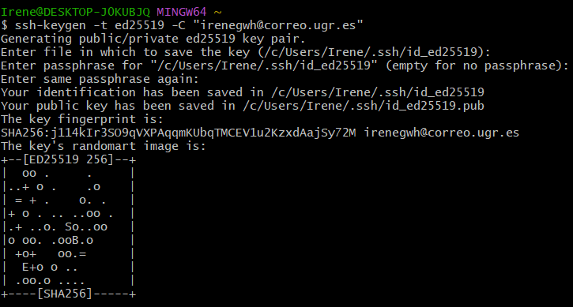
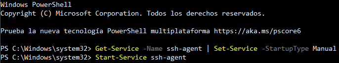

# Creación y configuración de la cuenta de GitHub

## Ajustes del perfil de usuario
Desde la interfaz de GitHub, se pueden configurar los ajustes del perfil público de nuestra cuenta. Se han añadido:

- **Nombre y apellidos**: Irene Gosálvez White
- **Dirección de correo pública**: irenegwh@correo.ugr.es
- **Localidad**
- **Compañía**: Estudiante de la Universidad de Granada
- **Imagen del perfil**


Además, desde Git Bash, se ha configurado el nombre y el email de los commits con los siguientes comandos:

```bash
$ git config --global user.name "Irene Gosálvez White"
$ git config --global user.email "irenegwh@correo.ugr.es"
```


# Creación del par de claves SSH pública/privada
Para mantener una comunicación segura entre el usuario y el servidor, se generó un par de claves SSH (pública/privada).

Primero, desde Git Bash, se generó el par de claves con el siguiente comando:
```bash
$ ssh-keygen -t ed25519 -C "irenegwh@correo.ugr.es"
```


El archivo se generó en el directorio .ssh/ y se añadió una passphrase.

Después, se añadieron las claves al ssh-agent desde PowerShell:
```bash
Get-Service -Name ssh-agent | Set-Service -StartupType Manual
Start-Service shh-agent
ssh-add */.ssh/id_ed25519
```



Luego, se copió la clave pública y se añadió en GitHub (Ajustes > SSH and GPG keys):
```bash
$ clip < ubicacion del archivo con la clave pública.
```


Se añadió la clave copiada, asignándole un nombre que identifique el dispositivo y seleccionando "Authentication key".

# Activación del segundo factor de autenticación
Para activar el doble factor de autenticación, se fue a la configuración de la cuenta en Settings > Password and authentication > Two-factor authentication.
En este caso, se activó el método "Authentication App", configurando la cuenta para que el código se genere desde una app externa (Google Authenticator).
