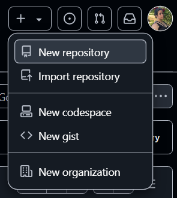
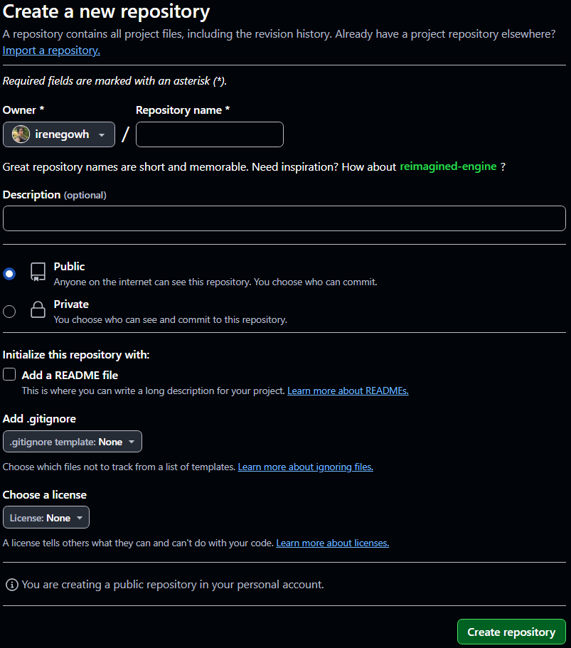
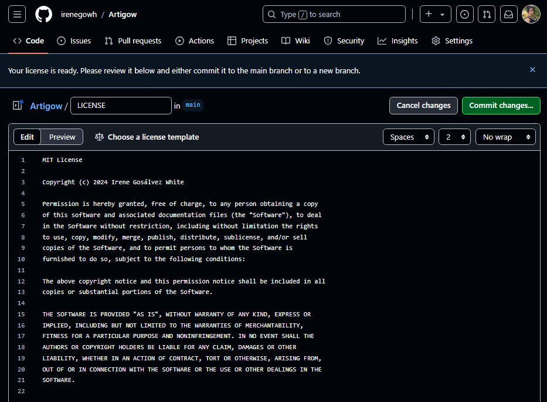
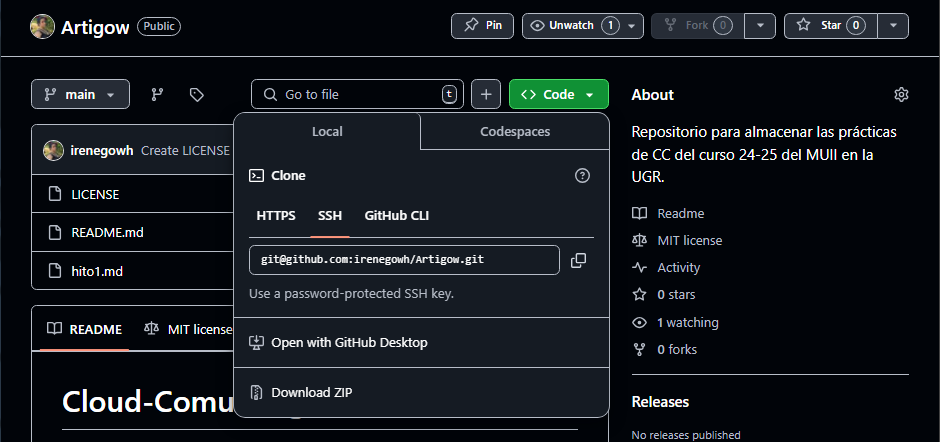
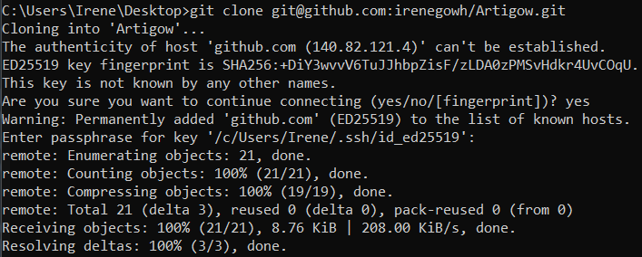
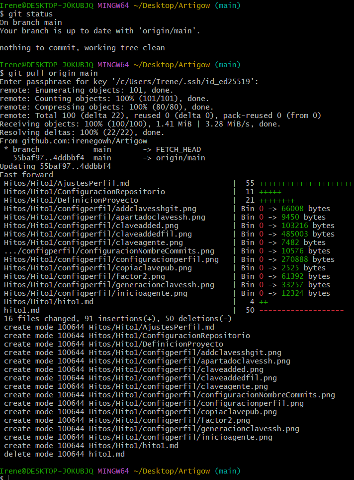

# Creacion y documentacion del repositorio Artigow
## Configuración inicial
En este apartado se detallan los pasos seguidos para la creación y configuración del repositorio git, el cual será utilizado para el control de versiones del proyecto y la entrega de cada hito.

Una vez iniciada la sesión en GitHub, en la página principal se pulsa el botón "New Repository" para crear un nuevo repositorio.


Los parámetros configurados han sido los siguientes:
- **Nombre del repositorio:** Especificamos un nombre adecuado para el proyecto (en este caso, Artigow).
- **Descripción:** Incluimos una breve descripción del propósito del repositorio.
- **Visibilidad:** Seleccionamos si el repositorio será público o privado (en este caso, público).
- **Archivo README:** Marcamos la opción para generar un archivo README.md.
- **Licencia:** Seleccionamos la licencia más adecuada para nuestro proyecto (en este caso, MIT).



## Licencia
Hay distintos tipos de licencia, en mi caso he escogido la licencia tipo MIT. Este tipo permite la reutilización del proyecto pero manteniendome como propietaria.


## Creación del archivo gitignore
De momento, se ha creado un archivo .gitignore básico que podrá modificarse más adelante.

## Clonación del repositorio
Para trabajar en local, es neceario clonar el repositorio. Para ello se usa el comando:
```bash
git clone nombre_repositorio
```



Una vez realizados los cambios locales, estos deben subirse al repositorio remoto usando los comandos:
```bash
git add .
git commit -m "Descripción de los cambios"
git push origin main
```

Para obtener los cambios desde el repositorio remoto hacia el local, se utiliza:
```bash
git pull
git push origin main
```
