# Implementación de la funcionalidad de creación de publicaciones

En este apartado se explica la primera parte desarrollada de la aplicación en la que se implementó:

- Página web de bienvenida

- Funcionalidad de creación de publicaciones

- Funcionalidad de listado de publicaciones disponibles

- Pagina para borrar todos los post (de prueba, posteriormente cuando se implementé la funcionalidad de login y se pueda distinguir entre usuarios con privilegios y sin privilegios se añadirá una funcionalidad especifica para borrar post de manera individual).

## 1. Lógica general de la aplicación

Esta aplicación se basa en Flask, un framework web ligero para Python, que te permite construir aplicaciones web de manera rápida. El propósito de la aplicación es permitir a los usuarios crear publicaciones, visualizarlas, y manejar imágenes asociadas a las publicaciones.

## 2. Estructura de carpetas y archivos

Primero se crearon los directorios que se iban a necesitar para la aplicación.

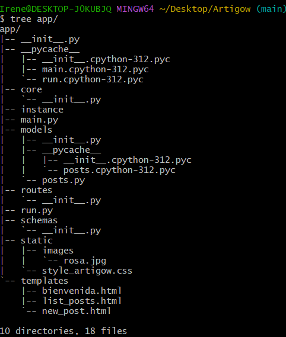

- **__init__.py:** En todos los directorios se encuentra el archivo __init__.py cuya función es convertir la carpeta en un paquete Pyton, y permite importar módulos de la carpeta en la que se encuentra en otros archivos del proyecto.
- **pycache** Esta carpeta es creada automáticamente por Python para almacenar archivos de caché compilados (.pyc). Mejora el rendimiento al evitar recompilar archivos Python cada vez que se ejecutan.
- **core:** En esta carpeta generalmente se encuentran configuraciones y funcionalidades centrales que usa toda la aplicación. Esto puede incluir la configuración de la base de datos, la gestión de autenticación, o el manejo de permisos y configuraciones de la aplicación (variables de entorno, parámetros globales).
- **instance:** Esta carpeta suele usarse para almacenar archivos específicos de la instancia de la aplicación, como configuraciones de producción o desarrollo. En Flask, por ejemplo, instance puede contener archivos de configuración o bases de datos que no están incluidas en el código fuente principal.
- **main.py:** Este archivo es el punto de entrada de tu aplicación. Contiene el código para iniciar el servidor, definir rutas iniciales y ejecutar la aplicación. Es el archivo que normalmente ejecutarías para iniciar la aplicación.
- **models:** Esta carpeta contiene las definiciones de los modelos de datos. Los modelos representan las entidades de la base de datos (como Usuario, Publicación, etc.). Cada modelo mapea una tabla en la base de datos y define su estructura, incluyendo atributos y relaciones con otros modelos.
- **routes:** Aquí se definen las rutas o endpoints de la aplicación, que responden a las peticiones HTTP. Estas rutas manejan la lógica de negocio, reciben las solicitudes de los usuarios, y devuelven las respuestas (por ejemplo, crear una publicación, votar, obtener el ranking).
- [r](http://run.py/)un.py Este archivo es otro punto de entrada para lanzar la aplicación. A menudo es similar a [m](http://main.py/)ain.py, pero puede usarse para configuraciones específicas de despliegue o arranque, como el modo de depuración o ajustes del entorno. En algunos proyectos, se usa para ejecutar scripts específicos de mantenimiento o tareas adicionales.
- schemas
Ubicación: |-- schemas
Función: Los esquemas (schemas) definen la estructura de los datos que se envían y reciben en las solicitudes y respuestas de la API. Usualmente, se usan para validar y serializar los datos, asegurándose de que las solicitudes tienen el formato correcto. En FastAPI, por ejemplo, los schemas suelen definirse con Pydantic para validar los datos automáticamente.
- static: Esta carpeta se usa para almacenar archivos estáticos que no cambian en cada solicitud, como imágenes, archivos CSS, JavaScript y otros recursos de diseño. Estos archivos se cargan directamente en el navegador del usuario. En mi caso, contiene una carpeta images donde se almacenaran las imagenes estáticas correspondientes a los posts.
- style_artigow.css: Archivo CSS que define los estilos personalizados para tu aplicación, dándole un diseño visual específico.
- templates: Contiene las plantillas HTML que renderiza tu aplicación cuando responde a las solicitudes de los usuarios. En el contexto de un framework como Flask o FastAPI con Jinja2, esta carpeta se usa para almacenar plantillas que contienen el HTML dinámico de la aplicación.
- bienvenida.html: Una plantilla HTML que probablemente muestra un mensaje de bienvenida a los usuarios.
- lists_posts.html: Una plantilla HTML que posiblemente se utiliza para mostrar una lista de publicaciones (o posts), mostrando el contenido que los usuarios han subido.

## 3. Lógica de la gestión de publicaciones y otros pasos iniciales
1. run.py

Este archivo run.py configura y ejecuta la aplicación de Flask y proporciona una ruta para eliminar todas las publicaciones y votos en la base de datos, además de borrar las imágenes asociadas a las publicaciones. 

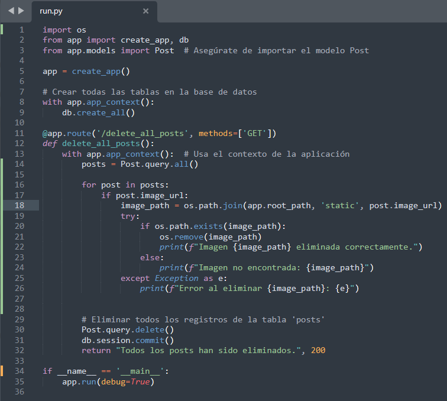

2. main.py

Este archivo define las rutas de la aplicación, organizadas bajo el Blueprint main_bp para una mejor modularidad:

Ruta de bienvenida (/): Renderiza una página de bienvenida (bienvenida.html).
Ruta para listar publicaciones (/list_posts): Muestra todas las publicaciones en la base de datos, obteniéndolas de la clase Post y renderizando list_posts.html.
Ruta para crear nueva publicación (/new_post): Permite crear publicaciones, incluyendo la carga de imágenes. Verifica que el archivo sea de imagen antes de guardarlo y crea una entrada en la base de datos con los detalles de la publicación.

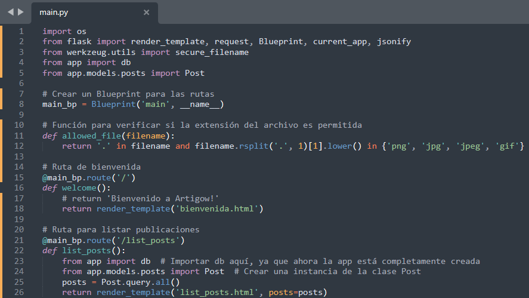
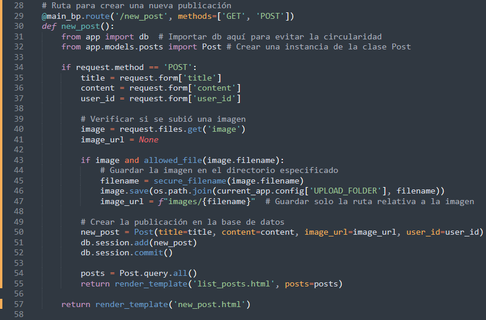

3. posts.py

Este archivo define el modelo Post para la base de datos de SQLAlchemy, que representa una publicación:

Campos: id, title, content, image_url, user_id, y date_posted.
Método create_post: Método estático que permite crear una publicación desde una solicitud JSON, guardándola en la base de datos y devolviendo una respuesta en formato JSON para su uso en una API o en pruebas.

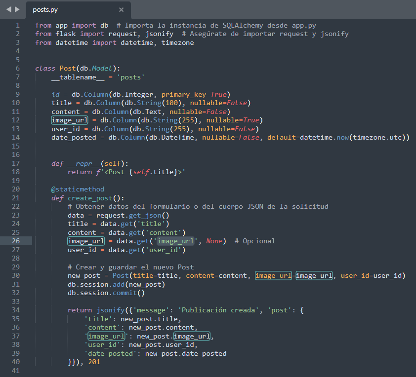

4. __init__.py principal

Aquí se configura la aplicación principal de Flask:

Configuración de la base de datos: Se establece la URI de SQLite y se desactiva el seguimiento de modificaciones para mejorar el rendimiento.
Directorio de carga: Configura el directorio UPLOAD_FOLDER para almacenar las imágenes.
Inicialización de la base de datos: Usa Flask-Migrate para gestionar la migración de la base de datos.
Registro del Blueprint main_bp: Permite que las rutas definidas en main.py estén disponibles en la aplicación.

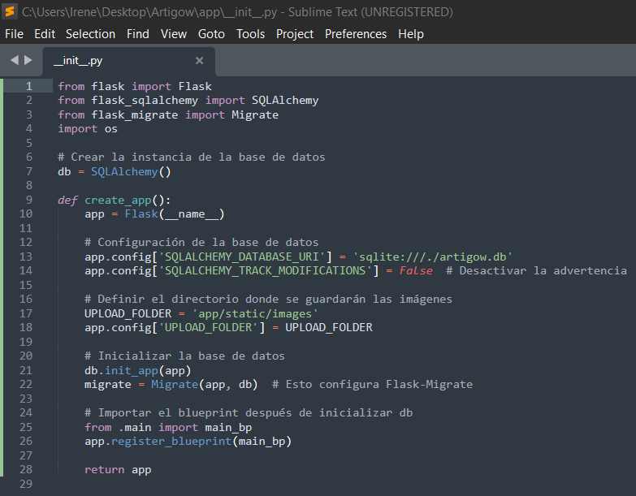

5. __init__.py en models
   
Importa el modelo Post para que esté disponible cuando se importe app.models.
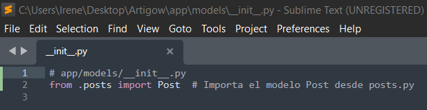

6. bienvenida.html
   
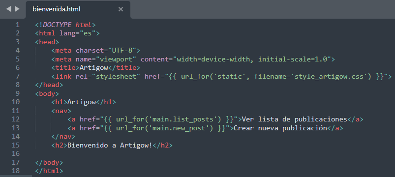

7. list_posts.html

Archivo HTML para mostrar la lista de publicaciones en la página:
Encabezado y navegación: Similar a run.py.
Lista de publicaciones: Muestra el título, contenido, ID de usuario, fecha de publicación, y la imagen (si existe) para cada publicación. Incluye un mensaje si no hay publicaciones.

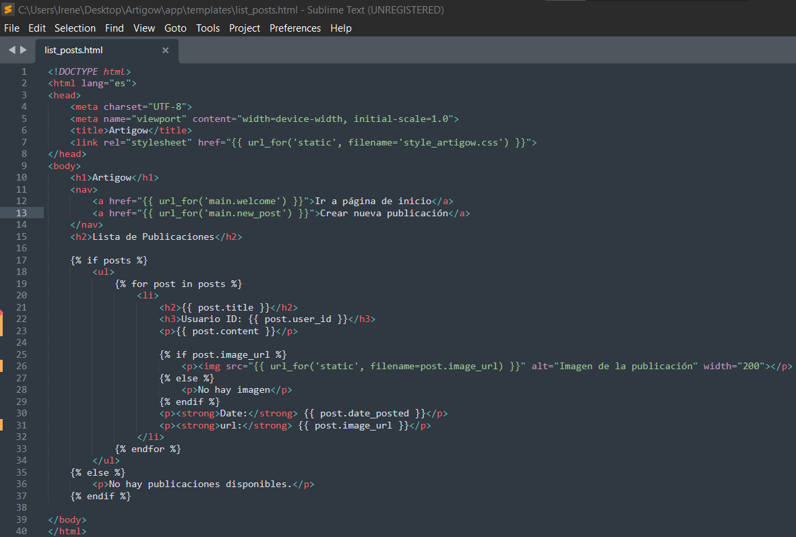

8. new_post.html

Formulario HTML para crear una nueva publicación:
Formulario: Recoge el título, contenido, imagen y el ID del usuario de la publicación.
Método de envío POST: Permite enviar los datos al servidor para que se guarden en la base de datos.

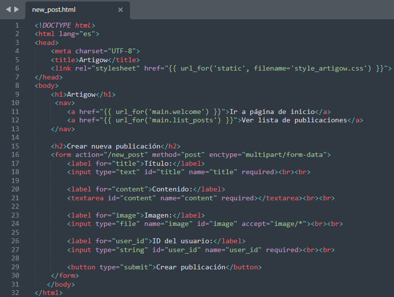

## 4. Vistas de la aplicacion

- Página de bienvenid
  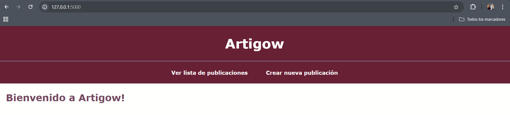
  
- Lista de publicaciones (vacia)
 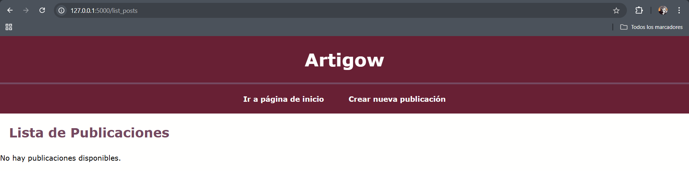  

- Creación de una publicación
  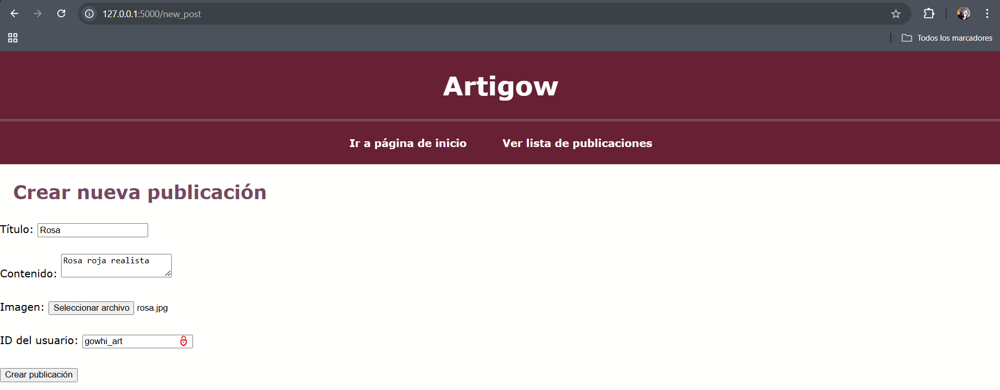

- Lista de publicaciones (con una publicación)
  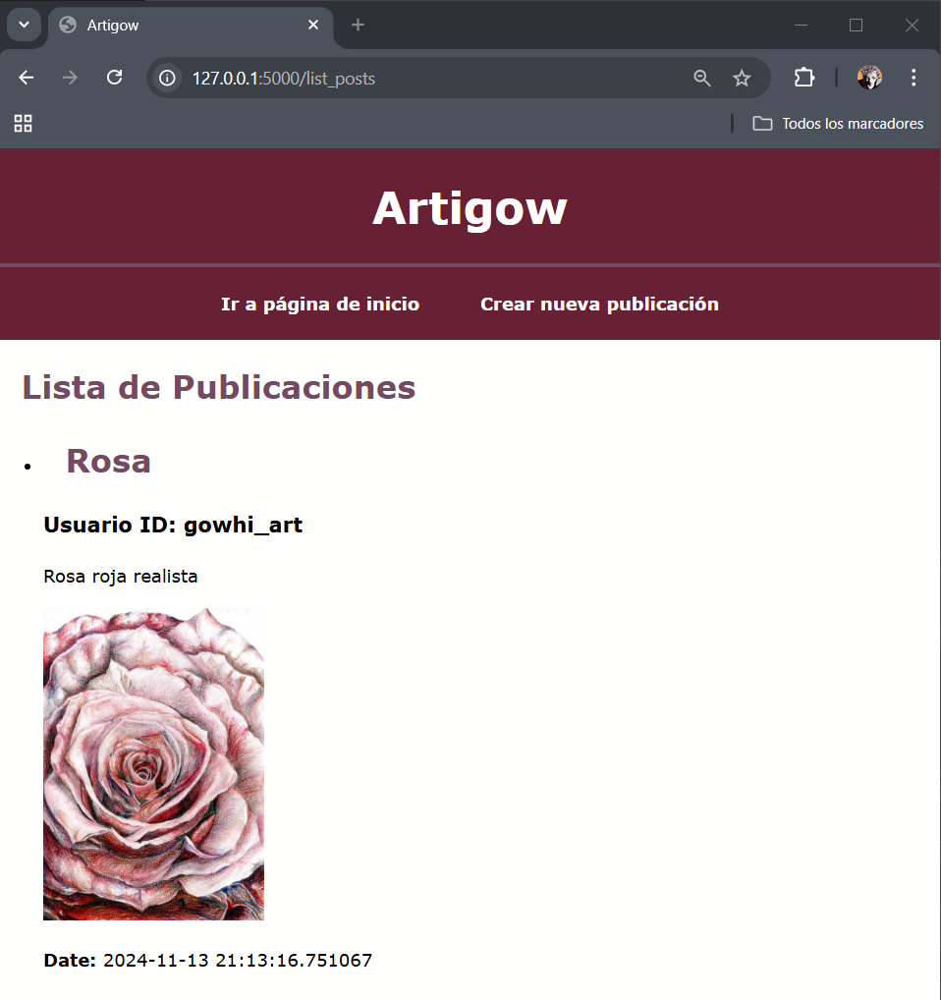
  
- Eliminación de las publicaciones
 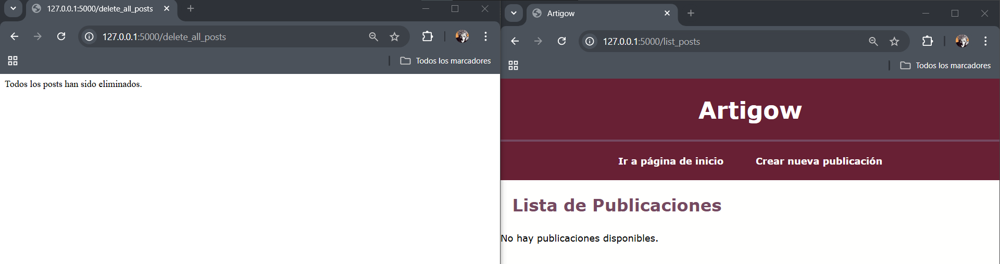

