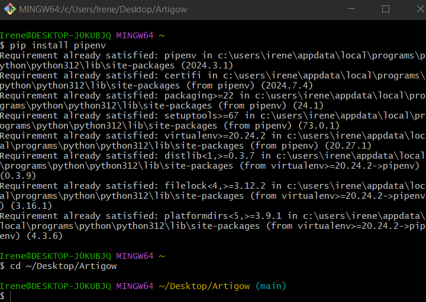
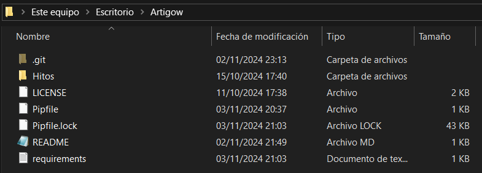
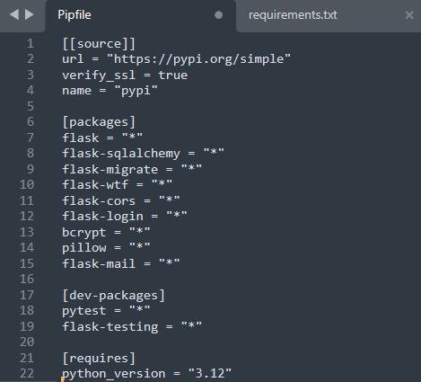
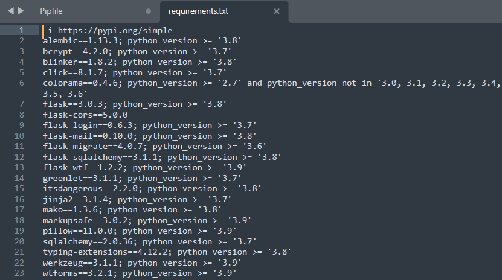

# Configuración del gestor de dependencias

Un gestor de dependencias es una herramienta que facilita la instalación, actualización y organización de las bibliotecas necesarias para el desarrollo de un proyecto, manteniendo controladas las versiones y garantizando que todos los colaboradores trabajen con las mismas dependencias.

En este proyecto, pensado para desarrollarse con Python Flask, se decidió utilizar pipenv y pipfile para el futuro uso de microservicios y contenedores en el proyecto, y permitir un manejo adecuado de las dependencias y entorno.
Se ha escogido este gestor de dependencias porque es compatible con el lenguaje de programación que se va a utilizar, y permite crear un entorno aislado y administrar las dependencias con un archivo Pipfile directamente, lo cual es muy util para proyectos que planean usar microservicios y contenedores. Esto asegura la consistencia y facilita la portabilidad del entorno entre diferentes máquinas y entornos de desarrollo.

Para Pipenv se siguieron los pasos descritos a continuación.

## 1. Instalación de Pipenv

Desde Git Bash, se ejecutó el siguiente comando para instalar pipenv:
```bash
pip install pipenv
```



## 2. Creación del entorno virtual

Desde el directorio donde está el repositorio local, se ejecutó el siguiente comando para crear un nuevo entorno virtual y un archivo Pipfile:
```bash
pipenv install 
```
Esto generó el archivo Pipfile en el directorio del proyecto, permitiendo especificar las dependencias del proyecto.

## 3. Instalación de las dependencias
    
Se agregaron las dependencias básicas necesarias para el desarrollo actual del proyecto:

flask: para crear el servidor web y manejar las rutas.
flask-sqlalchemy: para gestionar la base de datos de manera sencilla.
flask-migrate: para manejar las migraciones de la base de datos.
flask-wtf: para manejar formularios de forma segura.
flask-cors: para permitir solicitudes de diferentes dominios (útil si el frontend está separado).
flask-login: para gestionar la autenticación de usuarios.
bcrypt: para hashear las contraseñas de los usuarios.
pillow: para manejar imágenes cuando los usuarios suben archivos en sus publicaciones.
flask-mail: para enviar correos electrónicos (por ejemplo, para verificación de correo).

Además, se instalaron dependencias específicas para el entorno de desarrollo:
pytest: para realizar pruebas unitarias.
flask-testing: una extensión que facilita las pruebas de aplicaciones Flask.
    
## 4. Activación del entorno virtual:
Una vez instaladas las dependencias, para activar el entorno virtual, se utilizó el siguiente comando:
```bash
pipenv shell
```
    
## 5. Exportar las dependencias
Adicionalmente, se creó un archivo requirements.txt desde el Pipfile generado con el comando:
```bash
pipenv requirements > requirements.txt
```






