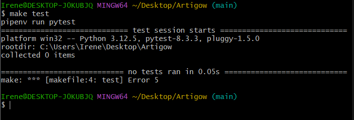

# Configuración del gestor de tareas

Este segundo apartado cubre la configuración del gestor de tareas, en este caso, **Makefile**. Se ha utilizado Makefile para facilitar la ejecución de pruebas, tanto de manera local como en el sistema de integración continua, mediante un solo comando.

A continuación, se detallan los pasos seguidos para configurar Makefile en este proyecto:

## 1. Creacion del archivo Makefile
    
Primero, se creó un archivo `makefile` en el directorio raíz del repositorio utilizando el siguiente comando desde **Git Bash**:

  ```bash
  touch makefile
  ```
    
## 2. Configuración inicial del makefile
    
 En este paso, se añadió una tarea básica en el Makefile para ejecutar las pruebas. Aunque esta tarea se configurará más adelante, en este momento se añadió el siguiente código al archivo:
  
```bash
    test:
    pipenv run pytest
```


Este comando ejecuta las pruebas definidas mediante pytest dentro del entorno virtual gestionado por pipenv.
    
## 3. Validar en local
    
Para verificar que el Makefile funciona correctamente, primero fue necesario instalar Make en Windows, ya que no es una herramienta nativa del sistema operativo. Los pasos para instalarlo fueron los siguientes:

- Intalacion make windows
Se ejecutaron estos comandos desde PowerShell para instalar Make utilizando Chocolatey:
  
  ```bash
    Set-ExecutionPolicy Bypass -Scope Process -Force; [System.Net.ServicePointManager]::SecurityProtocol = [System.Net.ServicePointManager]::SecurityProtocol -bor 3072; iex ((New-Object System.Net.WebClient).DownloadString('https://community.chocolatey.org/install.ps1'))
    choco install make
  ```  
Después, activa el entorno virtual con pipenv:
  
  ```bash
  pipenv shell
  ```
Y, finalmente, ejecuta el Makefile con el siguiente comando:
  
  ```bash
  make test
  ```

  
  
 En este caso, aunque el Makefile se ejecuta correctamente, muestra un error. Esto es normal porque aún no se han definido pruebas en el proyecto. En los siguientes pasos, se agregarán pruebas unitarias, lo que permitirá que esta tarea se ejecute correctamente.
