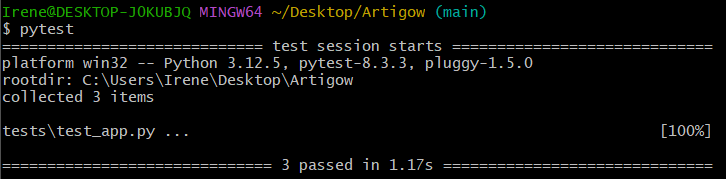
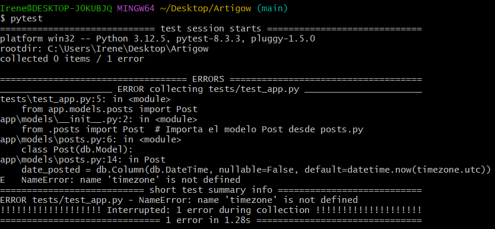
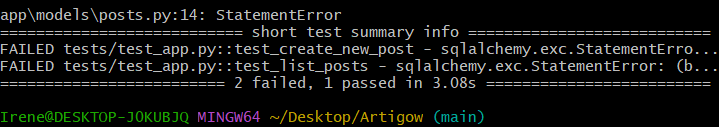

# Integración continua y proceso de pruebas

En este apartado voy a explicar las purebas de integración continua realizadas tanto para [6. Implementación de la funcionalidad de creación de publicaciones.](./CreacionPublicaciones.md) como para [7. Implementación de la funcionalidad de creación de votaciones.](./Votaciones.md).

## 1. Pruebas para la funcionalidad de creación de publicaciones.

Se ha configurado la inicialización de la aplicación y la base de datos en el script de pruebas mediante el uso de las funciones @pytest.fixture. Estas funciones configuran una instancia de la aplicación app() y un cliente de pruebas client(app), lo que facilita la ejecución de pruebas controladas en el entorno de la aplicación.
Las pruebas clave que se implementaron y se ejecutaron con éxito fueron:

- Prueba de la página de bienvenida

Esta prueba verifica que al acceder a la página principal ('/'), la respuesta sea un código de estado 200 (es decir, que se carga correctamente).
También comprueba que en el contenido de la respuesta esté el mensaje "Bienvenido a Artigow!". Esto asegura que la página de bienvenida muestra el mensaje correcto al usuario.
Esta prueba se ejecutó exitosamente, verificando que la página se renderice correctamente cuando se accede a la ruta principal de la aplicación.

- Prueba de creación de una nueva publicación

Esta prueba envía una solicitud POST a la ruta /new_post para crear una nueva publicación (post) con un título y contenido específicos.
Verifica que la respuesta tenga un código de estado 200 y que el título "Mi primer post" esté presente en la respuesta, confirmando que la publicación se ha creado y está visible correctamente.
También fue validada con éxito, confirmando que se puede crear y almacenar una publicación en la base de datos a través de la ruta correspondiente.

- Prueba de listado de publicaciones

Primero, agrega un post de prueba directamente en la base de datos con el título "Test Post" y un contenido de ejemplo.
Luego, hace una solicitud GET a la ruta /list_posts para obtener la lista de publicaciones.
Verifica que la respuesta sea un código de estado 200 y que el título "Test Post" esté en la lista, asegurando que la funcionalidad de listar publicaciones funciona correctamente.
Se validó con éxito la funcionalidad para listar publicaciones, asegurando que la aplicación recupera y muestra las publicaciones almacenadas.

A continuación se muestran capturas de pantalla de las pruebas que se ejecutaron satisfactoriamente. Los resultados muestran la correcta creación y visualización de publicaciones, indicando que los tres tests se pasaron con éxito.

Además de las pruebas exitosas, se incluyen ejemplos de pruebas que presentaron errores. Estas capturas ayudan a diagnosticar problemas y mejorar la funcionalidad de la aplicación en futuras implementaciones.

## 2. Pruebas para la funcionalidad de creación de votaciones.

Se añadieron otras tres pruebas:

- Prueba de votación de un post (test_vote_post())

Verifica que se puede votar por un post y que el voto se registra correctamente.
Usa el modelo `Post` para crear una nueva publicación con el título "Test Post" y el contenido "Test Content".
Guarda este post en la base de datos usando `db.session.add()` y `db.session.commit()`.
Usa el cliente de prueba (client) para enviar una solicitud POST a la ruta /vote_post/<post_id>, donde <post_id> es el ID de la publicación recién creada. Comprueba que la respuesta tiene un código de estado **302**, lo que indica una redirección. Asegura que la redirección sea a la ruta `/ranking`.
Por último, Consulta la tabla Vote y verifica que se haya registrado un voto (es decir, que la cuenta total de votos sea 1).

- Prueba de listado de votos (test_list_votes())

Crea dos publicaciones:`post1` con el título "Post 1" y `post2` con el título "Post 2". Guarda ambas publicaciones en la base de datos. - Crea un voto para `post1` y otro para `post2`. Guarda estos votos en la base de datos. Envía una solicitud GET a la ruta /ranking para obtener la lista de publicaciones ordenadas por votos. - Asegura que la respuesta tenga un código de estado **200** (éxito).
Comprueba que los títulos "Post 1" y "Post 2" aparezcan en los datos de la respuesta.
  
- Prueba de visualización de un post (test_show_post())

Crea un post con el título "Test Post" y el contenido "Test Content". Guarda este post en la base de datos. 
Usa el cliente de prueba para enviar una solicitud `POST` a la ruta `/show_post/<post_id>`.
Asegura que la respuesta tenga un código de estado **200** (éxito). Comprueba que tanto el título "Test Post" como el contenido "Test Content" aparezcan en los datos de la respuesta. Se asegura de que no aparezca el mensaje de error "Post no encontrado".

Se testeo usando pytest hasta que finalmente se ejecutaron con éxito todas las pruebas y sin warnings.

