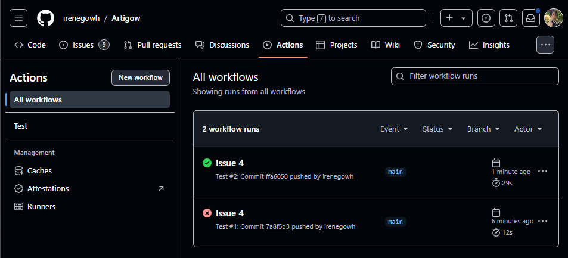

# Configuración del sistema de integración continua.

## 1. Prueba del sistema de integración continua 

(Explicación de la configuración en el apartado anterior [4. Selección y configuración del test runner.](./TestRunner.md)).

Para probar que el sistema de integración continua (CI) configurado con GitHub Actions se ejecuta correctamente, se realizaron los siguientes pasos con Git:

Añadir cambios:
```bash
git add .
```

Se añade todo el código nuevo o modificado en el repositorio local al área de preparación para que pueda ser confirmado.
Confirmar los cambios:

```bash
git commit -m "Issue 5"
```

Crea un commit con el mensaje "Issue 5", lo que representa los cambios realizados, y prepara el código para ser enviado al repositorio remoto.

Hacer push a la rama main:
```bash
git push origin main
```

Envía los cambios de la rama principal al repositorio en GitHub, lo que automáticamente activa el flujo de trabajo de GitHub Actions.

## 2. Resultados de la prueba
Al hacer el push a la rama main, GitHub Actions ejecuta el flujo de trabajo definido en test.yml. En este caso, uno de los tests falló, lo cual se puede observar en la pestaña Actions del repositorio en GitHub. Los detalles del fallo de prueba se ven al hacer clic en el flujo de trabajo fallido, donde se muestran los siguientes elementos:

- Log de Ejecución: Detalles de cada paso, desde la instalación de dependencias hasta la ejecución de las pruebas.

- Error Específico: El mensaje de error asociado al fallo del test, que puede incluir el módulo afectado o el tipo de error.

- Informe de Pruebas: Generado en report.xml, mostrando qué tests pasaron y cuáles fallaron. Esto es útil para identificar y corregir rápidamente los errores en el código.

Este flujo automatizado permite detectar problemas de forma inmediata y evita que código con errores se integre en el proyecto.


