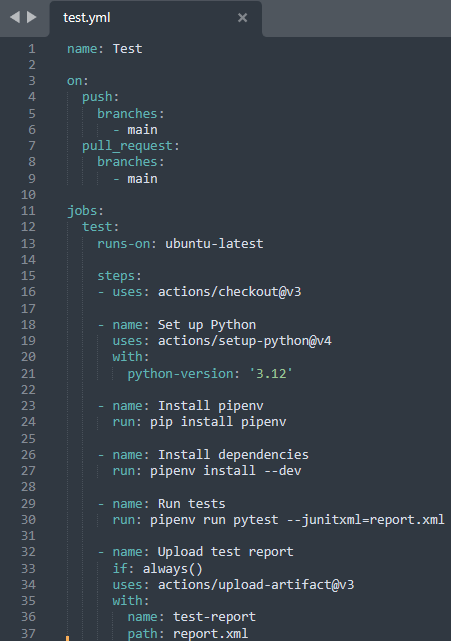

# Selección y configuración del test runner.
Para automatizar la ejecución de pruebas en cada commit o pull request y generar informes claros en el proyecto, se han seguido los pasos que se detallan a continuación:

## 1. Creción de un archivo de configuración para Github Actions.
Como se está utilizando Github para gestionar el repostorio del proyecto, se ha decidido utilizar Github Actions como test runner, que viene integrado directamente en la plataforma, por lo que la configuración es más sencilla y da acesso a los resultados sin necesidad de integraciones de terceros.
Además, permite ver los resultados y logs de ejecución directamente desde la pesataña "Actions", permite definir flujos de trabajo detallados, y los workflows son fácilmente configurables y soportan múltiples eventos como commits, pull reques y otros.


Para configurarlo, se creó la carpeta workflows con el comando:

```bash
mkdir -p .github/workflows
```

Dentro de esta carpeta se creó un archivo YAML, test.yml, para definir el flujo de trabajo:

```bash
touch .github/workflows/test.yml
```

## 2. Configuraciín del archivo YAML de GitHub Actions
En el archivo test.yml, se define el flujo de trabajo de pruebas.
En concreto se ha configurado para que permite GitHub Actions ejecute automáticamente pruebas en tu proyecto en cada commit o pull request a la rama main



El flujo de trabajo se llama "Test", y esto será visible en la pestaña "Actions" del repositorio en GitHub.
Se han especificado dos situaciones en las que se ejecutará el flujo de trabajo:
- Cada vez que se hace un push a la rama main.
- Cada vez que se abre o actualiza una pull request hacia main.

Define un job llamado test que se ejecutará en un entorno virtual con la imagen de Ubuntu más reciente (ubuntu-latest). Este entorno permite ejecutar todas las tareas de pruebas de la aplicación en un sistema limpio, evitando interferencias de configuraciones previas.

Descarga el código del repositorio para trabajar con la última versión, configura Python 3.12 en el entorno para asegurarse de que las dependencias y pruebas se ejecuten correctamente, instala pipenv para gestionar las dependencias del proyecto e instala las dependencias necesarias para el desarrollo, incluidas las de pruebas, definidas en el Pipfile.

Ejecuta los tests usando pytest, con la opción --junitxml=report.xml para generar un informe de resultados en formato XML.

En el ultimo paso, se asegura que el informe generado (report.xml) se almacene como un "artefacto" en GitHub, permitiendo descargarlo y revisar los resultados de las pruebas en detalle.

