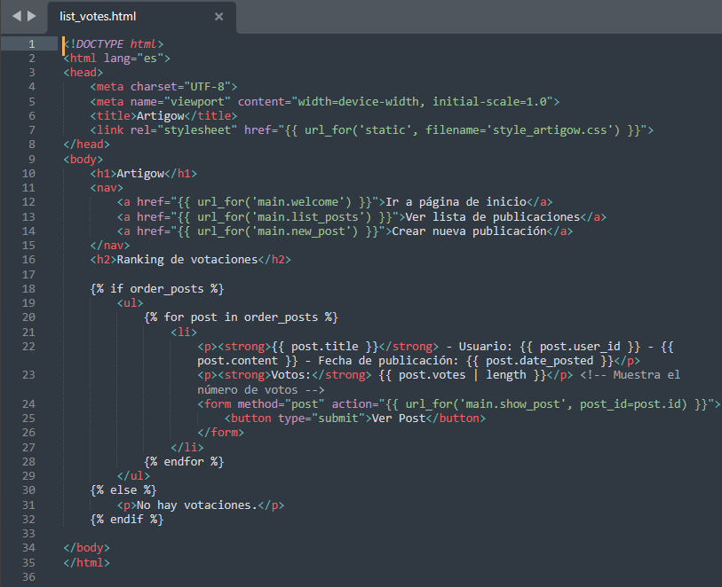
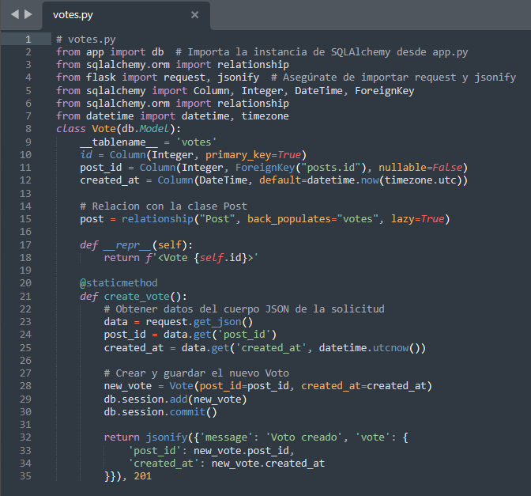
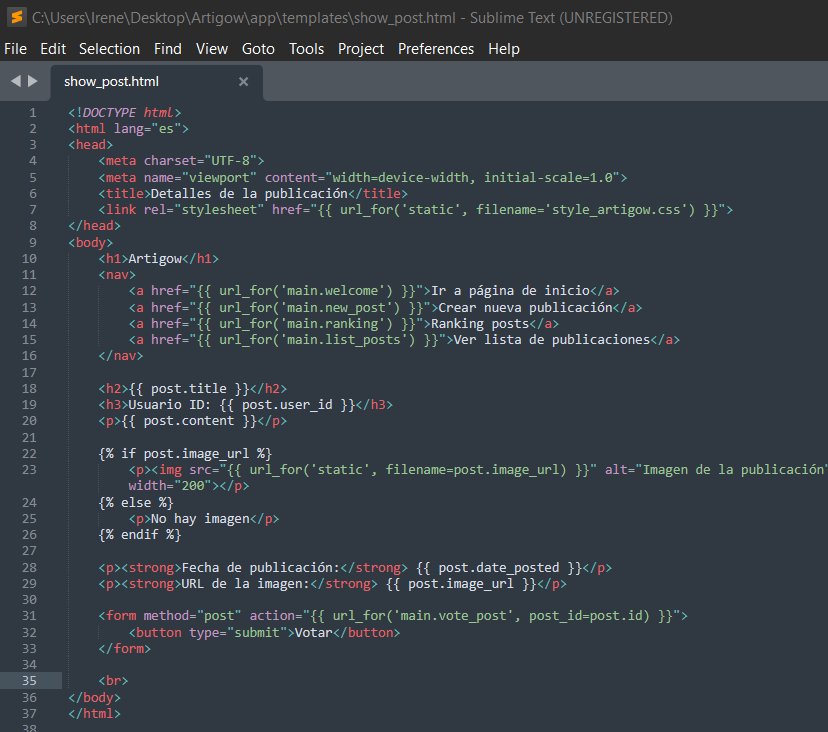
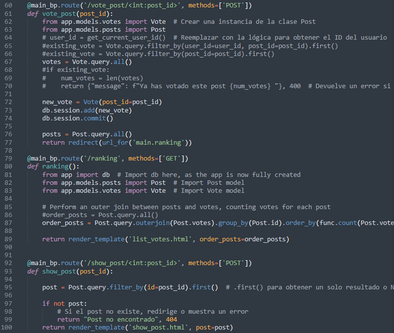
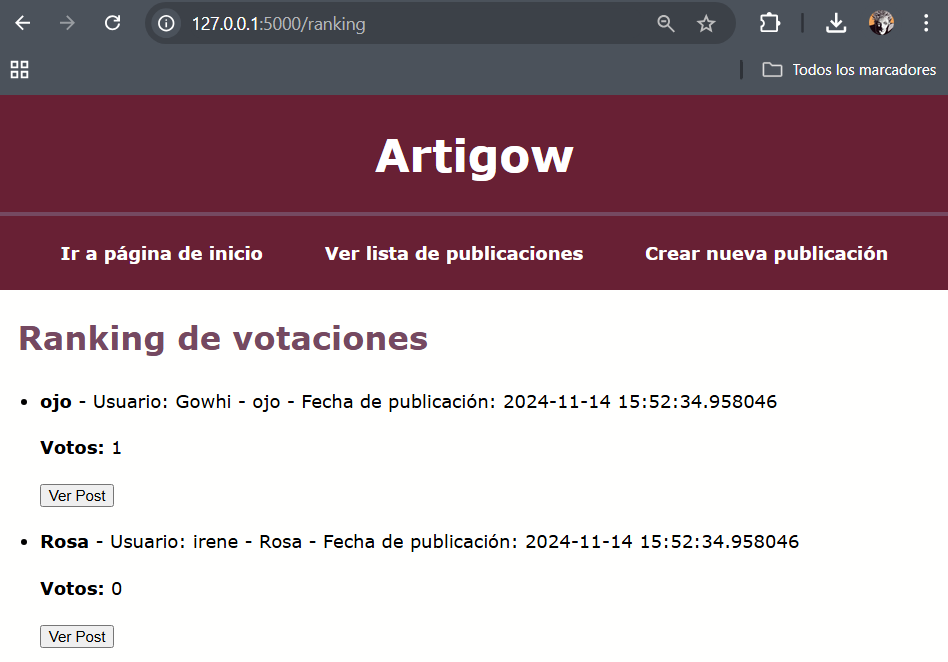
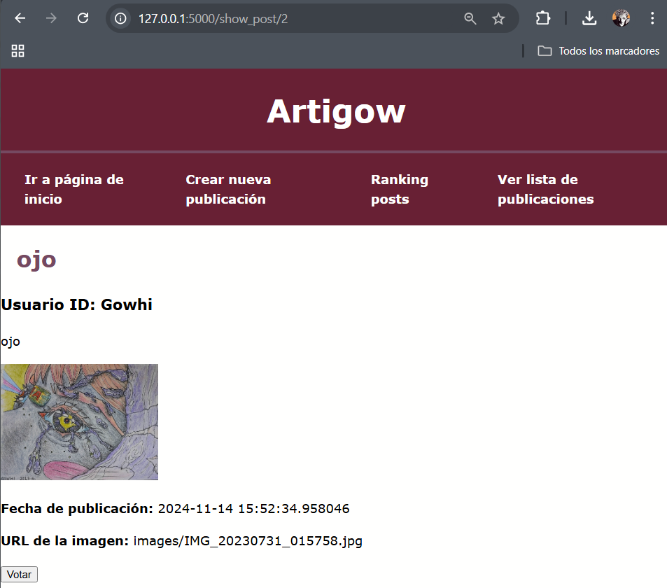
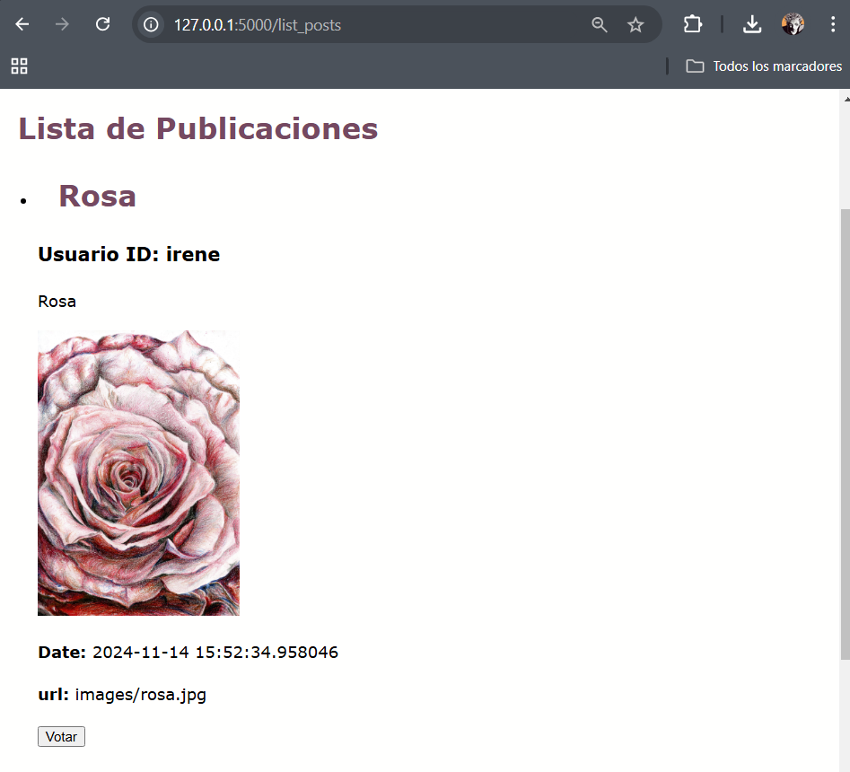

# Implementación de la funcionalidad de creación de votaciones.

En este apartado se explica como se ha integrado en la aplicación la nueva funcionalidad de votación de las publicaciones.
Se han añadido los ficheros:

## 1. Estructura archivos nuevos
- list_votes.html
  

- votes.py
  

- show_post.html
  

Y se han añadido nuevos métodos en [main.py](http://main.py):

- show_post
- ranking
- vote_post

Además, se han añadido las relaciones necesarias para relacionar el modelo Post con Vote, además de un nuevo botón en list_post.html para poder votar desde la lista de publicaciones.

## 2. Lógica de las votaciones
Modelo votes.py:

- **`id`**: Identificador único de cada voto.
- **`post_id`**: Hace referencia al `id` de un `Post`, estableciendo una relación de clave foránea.
- **`created_at`**: Almacena la fecha y hora en que se creó el voto, por defecto es la fecha y hora actual en UTC.
- **Relación con `Post`**: A través de `relationship("Post", back_populates="votes")`, se crea un vínculo bidireccional con la tabla `Post`.
- Método `create_vote()`
- **Función**: Crea un nuevo voto basado en el `post_id` recibido en un JSON desde el cliente.
- **Guardado en la base de datos**: Añade el voto a la sesión de la base de datos y realiza el `commit()` para guardar los cambios.

Métodos del main:

- Ranking()
    - **Consulta**: Usa una **outer join** para contar los votos por publicación, ordenando las publicaciones por la cantidad de votos de forma descendente.
    - **Renderizado**: Muestra la lista en la plantilla `list_votes.html`.
- vote_post()
    - **Funcionalidad**: Cuando un usuario envía una solicitud `POST` a `/vote_post/<post_id>`, se crea un nuevo voto para el post con ese `post_id`.
    - **Redirección**: Después de votar, redirige al usuario a la página de ranking.
- show_post
    - **Funcionalidad**: Recupera un post según el `post_id` y muestra sus detalles.
    - **Gestión de errores**: Si el `post` no existe, devuelve un error 404.

list_votes.html:

Muestra una lista de publicaciones con su respectivo conteo de votos:

- **Muestra información del post**: Título, usuario, contenido, fecha y número de votos.
- **Botón "Ver Post"**: Redirige a la página de detalles del post.

show_post.html:

Muestra los detalles completos de un post individual:

- **Información del post**: Título, contenido, imagen (si existe), y fecha.
- **Botón de votación**: Permite al usuario votar por el post directamente desde esta vista.

Modificaciones en Posts.py
Se define la relación entre `Post` y `Vote`:

votes = db.relationship('Vote', back_populates='post')

**`back_populates`**: Crea una relación bidireccional entre las tablas `Post` y `Vote`.

En list_posts.html se ha añadido un nuevo botón para votar que hace un consulta post a l método vote_post.

## 3. Vistas de la aplicación para las votaciones
- Lista de votos
  
  
  
- Visualización de un post desde la lista de votos
  
  
  
- Botón para votar
  
  
  
