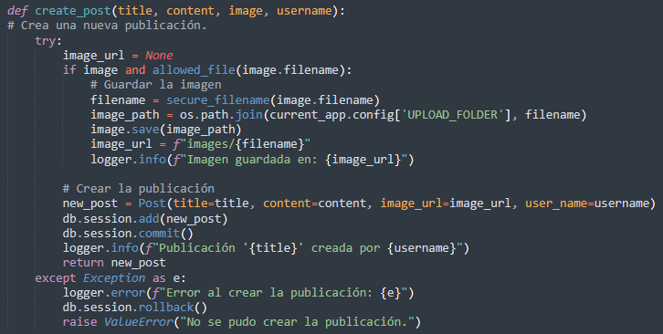
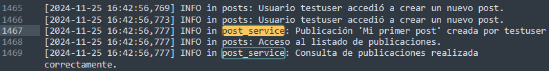
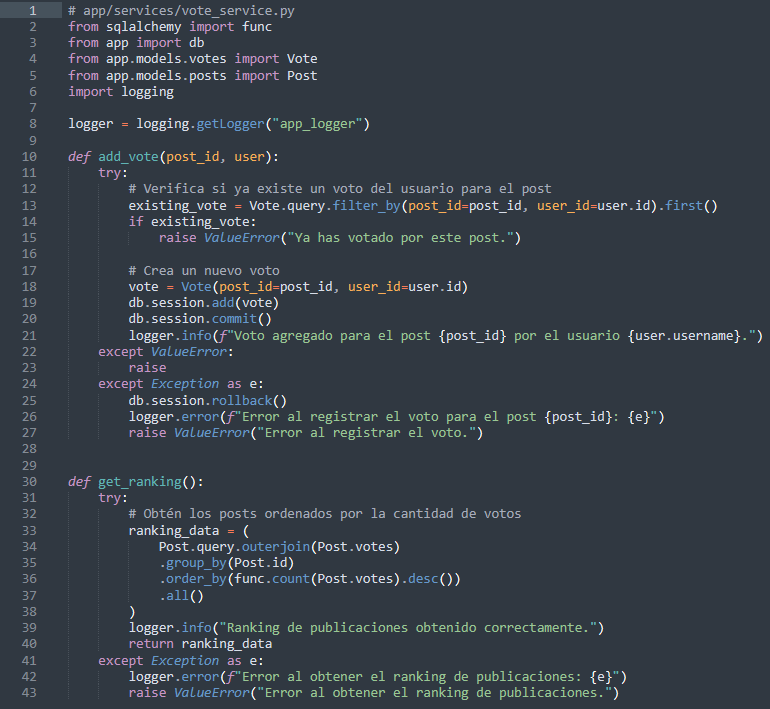
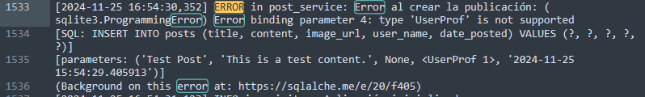

# Logging

### **Gestión de Logs en la Aplicación**

La gestión de logs se implementa utilizando el módulo nativo **`logging`** de Python, configurado para registrar eventos clave en las distintas operaciones de la aplicación. Este enfoque permite monitorear el comportamiento del sistema, depurar errores y registrar acciones importantes.

La elección de `logging` para este microservicio, pensando en que el proyecto está basado en **Flask** y **SQLAlchem,** se justifica por su capacidad de integración nativa, flexibilidad en la personalización de formatos y niveles de log, y su facilidad para registrar tanto la actividad de la API como las interacciones con la base de datos. Este sistema de logging proporciona una visibilidad completa del comportamiento del microservicio, permitiendo la depuración eficiente y el monitoreo continuo del sistema, lo cual es esencial para asegurar su correcto funcionamiento en producción.

---

### **Configuración General**

1. **Configuración básica del logger**:
    - El logger principal, **`app_logger`**, se inicializa en los *blueprints* y servicios.
    - Los mensajes se registran en niveles como **`INFO`**, **`WARNING`** y **`ERROR`**, dependiendo de la criticidad del evento.
2. **Formato y Salida**:
    - Los logs incluyen detalles como la fecha, la hora, el nivel de registro y el mensaje.
    - Se pueden registrar en la consola o en archivos para análisis posterior.

---

### **Ejemplos de Uso de Logs**

### **1. Logs en los Blueprints**

Los *blueprints* utilizan logs para registrar accesos a rutas y errores de validación:

- **Rutas de Publicaciones** (**`posts.py`**):
  
    ```python
    logger.info(f"Usuario {current_user.username} accedió a crear un nuevo post.")
    logger.error(f"Error al crear el post: {e}")
    
    ```
    - **INFO**: Indica acciones normales del sistema (e.g., un usuario accediendo a una ruta).
    - **ERROR**: Captura excepciones en tiempo de ejecución, como errores de validación.

-  **Rutas de Votos** (**`votes.py`**):
  
    ```python
    logger.info(f"Usuario {current_user.username} votó por la publicación {post_id}.")
    logger.error(f"Error al registrar el voto: {e}")
    
    ```
    
### **2. Logs en los Servicios**

Los servicios utilizan logs para registrar eventos en la lógica de negocio. Los logs ayudan a depurar problemas al interactuar con los repositorios o la base de datos.

- **Servicio de Publicaciones** (**`post_service.py`**):

Ejemplo del uso de logger en el servicio de publicaciones:



Ejemplo de logs generados por la ruta y el servicio de publicaciones:


- **Servicio de Votos** (**`vote_service.py`**):



Ejemplo de logs generados tras votar una publicacion por la ruta y el servicios de votos:


### **3. Logs en la Gestión de Errores**

El logger captura errores y los incluye en la respuesta al usuario:

```python
logger.error(f"Recurso no encontrado: {error}")
abort(404, description="Recurso no encontrado")

```

Esto garantiza que los errores críticos sean detectados y registrados para análisis.

Ejemplos de logs generados por alguna situación que provocaba algún error:




Mediante la implementación de la gestión de logs se proporciona un historial  detallado de las acciones y errores del sistema, que sirve para mantener la trazabilidad de las acciones, y también facilita las tareas de la depuración y de monitoreo.
