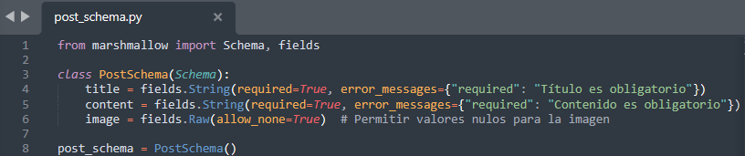
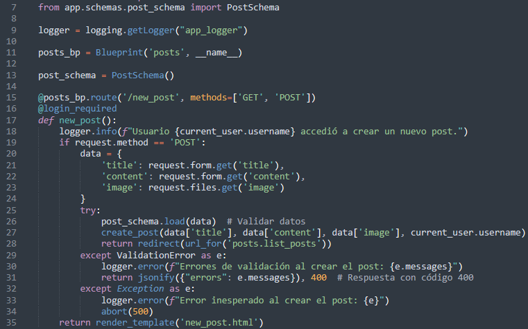
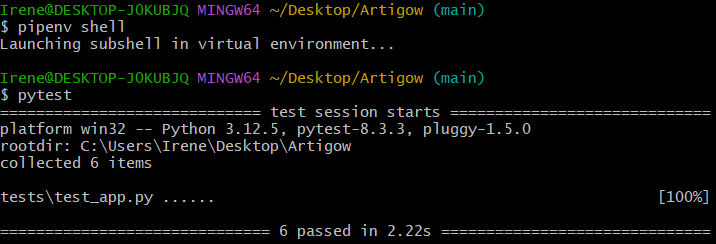
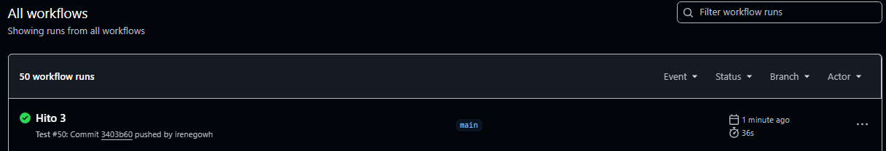

# Pruebas

Para este hito se han modificado los tests de intergración continua para validar la API de manera más adecuada.
Para ello, se ha utilizado en primer lugar Marshmallow para validar los datos mediante la definicion de un esquema.

Tambien se han realizado pruebas unitarias y funcionales apra garantizar el correcto funcionamiento de todos las rutas y servicios de la API.

A continuación se detalla como se ha realizado cada uno de estos puntos.

### 1. Validación de datos con Marshmallow

Se ha utilizado la biblioteca Marshmallow ara la validacion de datos, asegurando que la informacion proporcionada por la API cumple con los requisitos definidos. 

En concreto se ha verificado los valores del post durante la creación a partir del esquema PostSchema en el archivo app/schemas/post_schema.py:


El esquema es instanciado como post_schema y se usa para validar las entradas en las rutas correspondientes.

En este, se verifica que los campos obligatorios (title y content) esten presentes y para la imagen se mantiene como opcional permitiendo valores nulos.

---

### **2. Validación en la API**

En la ruta new_post, del archivo app/routes/post.py, se valida la información recibida antes de proceder a crear una nueva publicación con la línea:

```java
post_schema.load(data)  # Validar datos
```

En este caso, si los datos no son válidos, se lanza una excepción ValidationError, que es manejada para devolver un código **400 (Bad Request)** junto con los errores.


---

### **2. Pruebas de la API**

Al igual que en el hito anterior para la integración continua, se sigue utilizando **pytest** y clientes de prueba para realizar llamadas a las rutas de la API y verificar su comportamiento. 

Las pruebas simulan diferentes escenarios, incluyendo casos exitosos y errores esperados.

Para estas pruebas se están utilizando tres “fixtures” que son app, client  y authenticated_client

- app: Crea una instancia de la aplicación configurada para las pruebas, utilizando el esquema de configuración definido para el entorno de pruebas y no para el de desarrollo/producción, creando una base de datos en memoria. Configura un cliente de pruebas con autenticación e inicializa y limpia la base de datos y después de cada prueba.
- client: Proporciona un cliente de pruebas HTTP para simular solicitudes a la aplicación dentro de un contexto seguro.
- authenticated_client: Usa el cliente de prueba para registrar un nuevo usuario con datos predeterminados e iniciar sesión, para utilizarlo en las pruebas de los servicios en los que se requiere el rol de usuario autenticado.

A continuación, se explica cada uno de los casos definidos:

Pruebas de datos válidos:

1. test_welcome_message(client): Test de la página de bienvenida. Igual que en el hito 2.
2.  test_create_new_post(authenticated_client): Se envían datos válidos a la ruta /new_post para verificar que la publicación se crea correctamente.
    
    La prueba verifica que:
    
    - Se obtiene un código **200 (OK)**.
    - El contenido del post aparece en la respuesta.
3. test_list_posts(client): Crea un post de prueba en la base de datos. Solicita la lista de publicaciones y verifica que:
    - La respuesta sea exitosa (**200**).
    - El título del post aparezca en los datos devueltos
4. test_vote_post(authenticated_client): Crea un post asociado al usuario autenticado. 
    
    Envía una solicitud para votar por el post y verifica que:
    
    - La respuesta sea exitosa (**200**).
    - El mensaje de éxito *"Voto registrado correctamente."* esté presente en los datos devueltos.
5. test_ranking(authenticated_client): Crea múltiples posts y registros de votos para ellos.
Solicita el ranking y verifica que:
    - La respuesta sea exitosa (200).
    - Los títulos de los posts aparezcan en los datos devueltos.

Pruebas de datos invalidos:

1. **Prueba de rutas inexistentes**
    - test_404_not_found(client): Se prueba que la API devuelve un error **404 (Not Found)** para rutas no válidas:

---

### **3. Integración entre pruebas y validación**

Las pruebas están diseñadas para cubrir tanto los flujos exitosos como los casos de error:

- **Validación exitosa**: Se asegura que la API acepta y procesa correctamente los datos válidos.
- **Errores de validación**: Se prueban los casos en que faltan datos obligatorios o estos son incorrectos, verificando que la API devuelva errores adecuados y comprensibles.
- **Mensajes flash**: Las pruebas incluyen la verificación de mensajes flash en los casos en que son utilizados para proporcionar retroalimentación al usuario.

Al integrar las validación y las pruebas se pretende asegurar que la API maneja de manera correcta tanto los datos válidso como invalidos. También se busca dar una evidencia mendiante mensajes claros de error para ayudar tanto a usuarios como desarroladores y se busca dar cobertura de errores para distintos casos para garantizar la confiabilidad de la API en los distintos escenarios propuestos.



