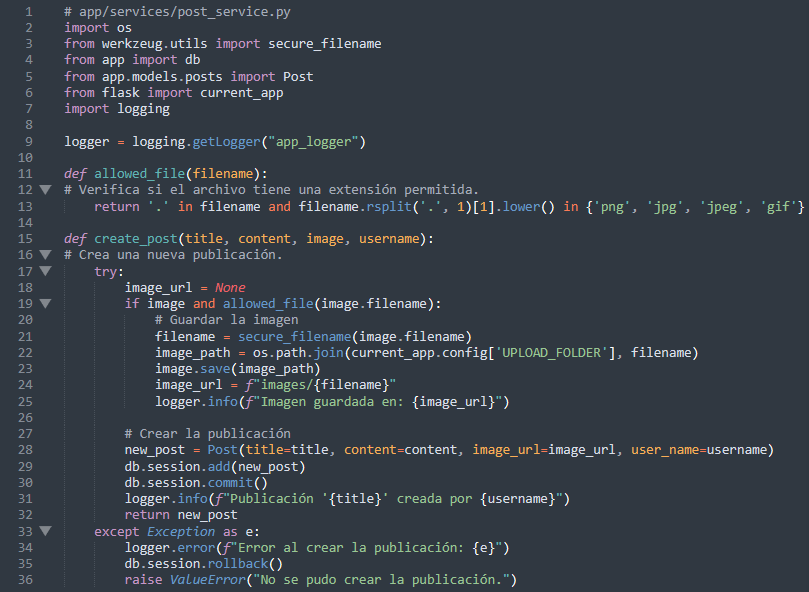
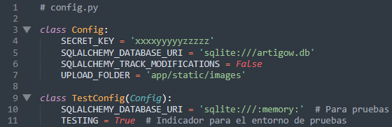

# **Estructura General de la Aplicación: Blueprints, Repositorios y Servicios**

### 

Para el desarrollo de la aplicación se ha seguido un diseño modular y desacoplado para mejorar la escalabilidad, el mantenimiento y la claridad del código. 

---

**1. Blueprints y Rutas (app/routes)**

Los **blueprints** permiten organizar las rutas en módulos independientes. Por ejemplo:

- **Rutas principales (`main.py`)**: Controla la página de bienvenida y vistas generales.
- **Autenticación (`auth.py`)**: Maneja el registro, inicio de sesión y cierre de sesión.
- **Posts (`posts.py`)**: Maneja las publicaciones (creación, listado, detalle, eliminación).
- **Votos (`votes.py`)**: Maneja la votación y el ranking de publicaciones.
- **Usuario (`user.py`)**: Maneja las vistas relacionadas con los perfiles de usuario.

Cada blueprint se registra en el archivo **`routes/__init__.py`** para que puedan ser importados fácilmente:

El propósito es dividir la lógica de cada funcionalidad en archivos separados, lo que facilita el mantenimiento y escalabilidad.

---

### **2. Repositorios (app/repositories)**

Los repositorios manejan la interacción directa con la base de datos, siguiendo el patrón de diseño **Repository Pattern**. Esto separa la lógica de acceso a datos de la lógica de negocio.

Se han inclurido los repositorios:

- post_repository.py: Gestiona las operaciones relacionadas con las publicaciones (**posts**) en la base de datos: (Obtener todas las publicaciones, buscar una publicación por su ID, crear una nueva publicación con título, contenido, imagen y nombre de usuario y eliminar publicaciones existentes).
- auth_repository.py: Maneja las operaciones relacionadas con la autenticación y los usuarios (Agregar un nuevo usuario (registro), buscar un usuario por su correo electrónico para verificar credenciales y configurar contraseñas de usuario mediante hashing.
- vote_repository.py: Se encarga de las operaciones sobre los votos (**votes**) (Agregar un voto a una publicación, obtener todos los votos asociados a una publicación.

Por ejemplo, **`post_repository.py`** contiene métodos para gestionar publicaciones.

Este diseño permite reutilizar el acceso a datos en diferentes servicios.

![imagenes/post_repository.png)

---

### **3. Servicios (app/services)**

Los servicios encapsulan la **lógica de negocio** y procesan datos recibidos de los controladores (blueprints). Usan los repositorios para interactuar con la base de datos.

Como servicios se han creado:

- auth_service.py:  Maneja la lógica de negocio relacionada con la autenticación y los usuario. (Valida los datos y llama a **`auth_repository`** para crear un nuevo usuario, verifica las credenciales del usuario y realiza la autenticación usando Flask-Login y cierra la sesión de un usuario autenticado).
- post_service.py:  Contiene la lógica relacionada con la gestión de publicaciones (Valida los datos, guarda imágenes, y utiliza **`post_repository`** para persistirlas, devuelve todas las publicaciones disponibles, borra las publicaciones de un usuario, eliminando también las imágenes asociadas y busca una publicación específica por su ID para mostrar sus detalles).
- user_service.py:  Proporciona lógica para las operaciones relacionadas con los usuarios (busca un usuario específico en la base de datos, utilizado para cargar información de perfil).
- votes_service.py: Se encarga de la lógica relacionada con los votos (verifica si el usuario ya ha votado por una publicación antes de registrar el voto y genera un listado de publicaciones ordenadas por la cantidad de votos.)

Ejemplo: **`post_service.py`** 

Este servicio valida los datos (e.g., formato del archivo).

Llama a métodos del repositorio para persistir la información.

---

### **4. Archivo de Configuración (config.py)**

Se ha creado un nuevo archivo que centraliza configuraciones para diferentes entornos (producción, desarrollo, pruebas).

Esto permite cambiar configuraciones fácilmente dependiendo del entorno.

