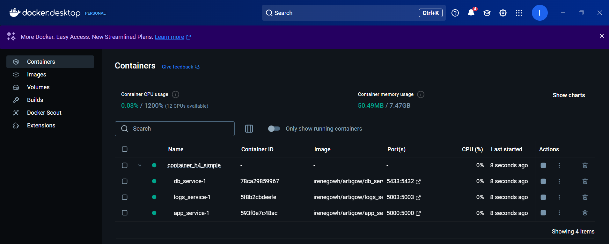
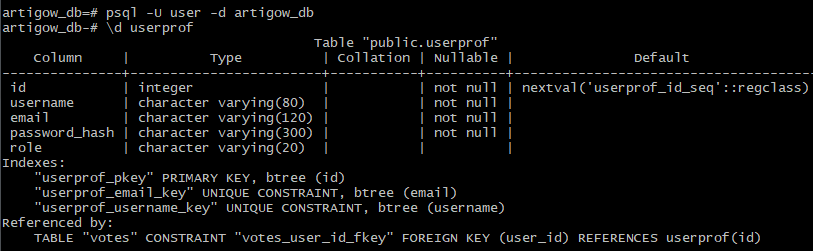
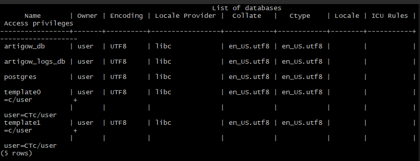
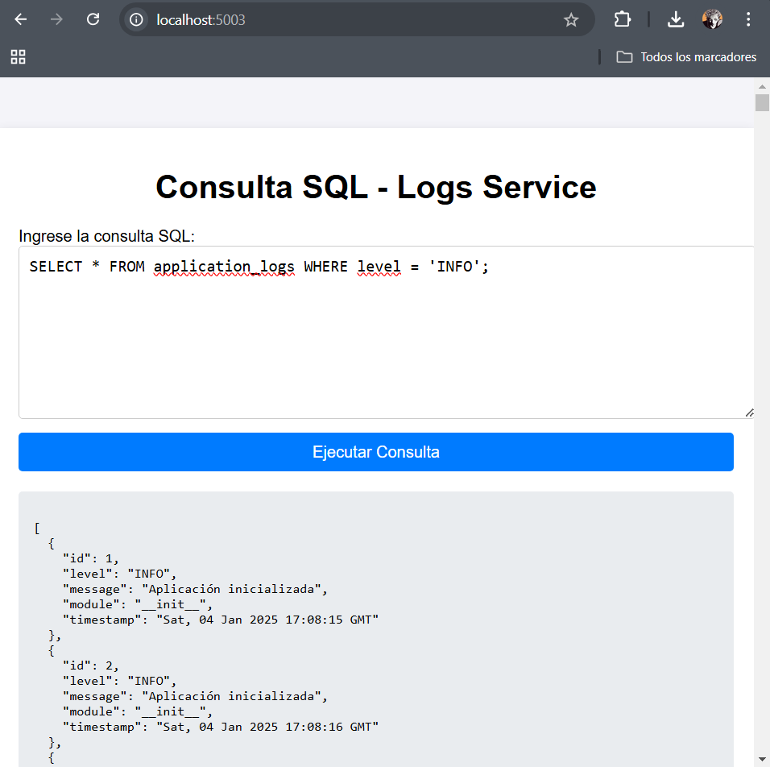

# Pruebas
Para poder ejecutar los contenedores, se tuvo que instalar Docker Desktop en windows.
Desde este se puede ver el estado de los contenedores y sus detalles sin necesidad de ejecutar los comandos de docker.


Sin embargo, un comando utilizado para acceder al contenedor y comprobar la base de datos desde este fue:
```bash
winpty docker exec -it 6d5ae402a6b7141868e2ac6ff53f5e2bba71102ca4638d45af1f7b3ae2719d42 bash
```

Desde este se puede acceder a la base de datos con: 
```bash
psql -U user -d artigow_db
```
Por ejemplo, con  '\d userprof' se pude ver la tabla creada para userprof y como el modelo userprof.py se está aplicando de manera correcta para crear la tabla.

Con \l se pueden ver las bases de datos creadas:



Para reiniciar el volumen, como esta puesto persistente, si se hacen cambios en el modelo:
```bash
docker-compose down -v
```

Para contruir y lanzar los contenedores con el docker-compose:
```bash
docker-compose up --build
```

Se puede acceder a la aplicación como se hacia con la aplicación monolítica. Todas las funcionalidades son las mismas.


También se puede acceder a http://localhost:5003/ para el contenedor de logs.
En este se podria ejecutar una consulta como la siguiente para ver los logs de la aplicación de nivel 'INFO':
```bash
SELECT * FROM application_logs WHERE level = 'INFO';
```



