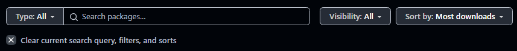

# Documentación de GitHub Packages.

## Explicación del workflow para Github Actions:
Para poder subir las imagenes de los contenedores a Github Packages como se solicita en el enunciado, se ha implementado un nuevo workflow en el archivo 
[Directorio contenedores](../../github/workflows/docker-publish.yml).

El archivo define un flujo de trabajo para construir y publicar imágenes Docker de tres servicios: db_service, app_service, y logs_service en el GitHub Container Registry (ghcr.io) cada vez que se hace un push a las ramas main o feature/**.
Proceso General
1. Checkout del código fuente: Se clona el repositorio usando actions/checkout@v3.
2. Login al GitHub Container Registry: Se autentica usando un token secreto CR_PAT configurado en los secrets del repositorio. A continuación se explica como se ha obtenido y configurado este token.
3. Construcción y publicación de imágenes: Para cada servicio (db_service, app_service, logs_service) se construye la imagen Docker con docker build.
y se etiqueta y publica en GitHub Container Registry (ghcr.io) con docker push.

## Configuración del token de autenticación CR_PAT:
Para que el flujo funcione correctamente, se ha configurado un token secreto llamado CR_PAT con permisos específicos para leer y escribir en Github Packages.
Los pasos seguidos han sido los siguientes:
1. Generar un Token Personal de GitHub:
Desde GitHub > Configuración de tu cuenta > Configuración de Desarrollador > Tokens (classic), se ha ejecutado la opción "Generate new token." 

Se le asignaron los permisos:
- write:packages (para publicar imágenes).
- read:packages (para leer imágenes).
Opcionalmente, se puede dar repo (para acceso a repositorios privados).


2. Añadir el Token a los Secrets del Repositorio:
Se copio el token generado., y desde el repositorio de Githun en Settings > Security > Actions > Secrets and variables, desde la pestaña Secrets, en New Repository secret se creo el secreto con el nombre CR_PAT y se pegó el token generado antes.


## Ejecución del Flujo de Trabajo
Para que se inicie el pipeline, se debe realizar un commit y un push a la rama principal (main) o cualquiera con el prefijo feature/.
Entonces, Github ejecuta automaticamente el flujo de trabajo definido en el archivo, al igual que hace con los tests de integración continua.


Como resultado, desde el apartado Actions en el repositorio se puede ver un flujo activo con el nombre Build and Publish Docker Images.

En las imagens, se puede ver un ejemplo del flujo fallando, y otro en el que se ha completado exitosamente y las imagenes se han subido al Github Packages.


Desde el apartado packages, en el repositorio, se pueden descargar las ultimas imagenes subidas. En esta sección se debe quitar el filtro si no aparecen (por algun motivo con el filtro no aparecen como subidas aunque el workflow se ha ejecutado correctamente)




Una vez subidas, se modifico el archivo docker-compose para que cada servicio utilice las imagenes subidas a Github Packages (ghcr.io). Un ejemplo de comfiguración especifica es:
```yaml
image: ghcr.io/irenegowh/artigow/app_service:latest
```
La ruta ghcr.io/irenegowh/artigow/app_service:latest indica que la imagen se encuentra en el registro de GitHub Container Registry.
Esto incluye el nombre de usuario/organización (irenegowh), el repositorio (artigow), y la etiqueta de la imagen (latest).
Antes de ejecutar docker-compose up, asegúrate de haber autenticado el cliente Docker con GitHub Packages usando el comando:
echo "${CR_PAT}" | docker login ghcr.io -u <USERNAME> --password-stdin
Donde CR_PAT es el token de acceso configurado.


