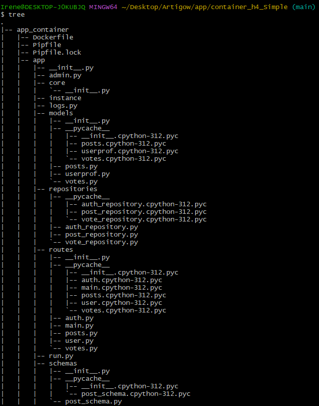
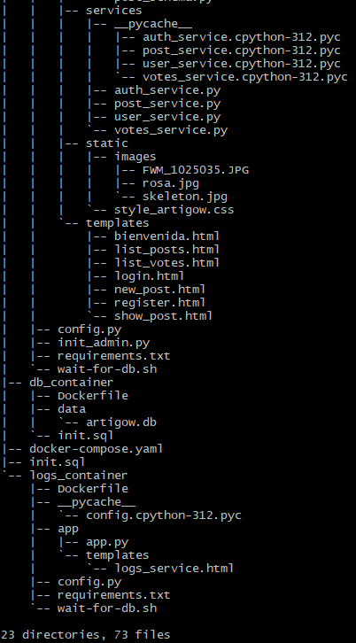

# Documentación y justificación de la estructura del clúster de contenedores
## Introducción

El diseño del clúster de contenedores para la aplicación Artigow busca 
abordar las necesidades de modularidad, escalabilidad y separación de 
responsabilidades, utilizando Docker Compose para su configuración. 
Este enfoque permite desplegar y gestionar la infraestructura de 
manera reproducible en entornos de desarrollo y pruebas.

El clúster está compuesto por tres servicios principales:
1. app_service: Contenedor principal que implementa la lógica de 
negocio de la aplicación Artigow.
2. db_service: Contenedor que gestiona dos bases de datos, una para 
los datos principales de la aplicación y otra para los logs.
3. logs_service: Microservicio para el procesamiento y visualización 
de logs.

Los archivos de los contenedores se han guardado en el repositorio en un directorio especifico [Directorio contenedores](../../app/container_h4_Simple/)

