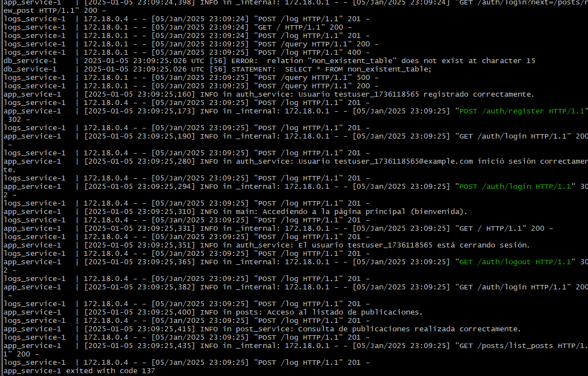
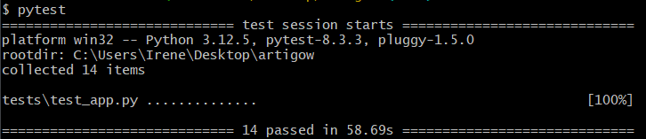

# Explicación breve de los tests de integración continua y conectividad entre contenedores
En el archivo [Dockerfile de db_service](../../tests/test_app.py) se han configurado nuevos tests para el entorno dockerizado, manteniendo los tests de la aplicación monolítica.
Estos tests verifican el correcto funcionamiento y la integración de los servicios desplegados en el clúster de contenedores definido con Docker Compose. Se centran en validar tanto la conectividad como las funcionalidades clave de cada contenedor.
Como propósito general de los tests estariía:
1. Integración continua: Garantizan que los servicios funcionan de manera conjunta en el entorno dockerizado.
2. Conectividad entre contenedores: Validan que los servicios pueden comunicarse entre sí (por ejemplo, el envío de logs desde la aplicación al contenedor de logs).
3. Resiliencia: Prueban escenarios con errores y aseguran respuestas apropiadas, mejorando la confiabilidad del sistema

Estos tests aseguran que el clúster se despliega correctamente y todos los componentes interactúan como se espera, tanto en condiciones normales como en situaciones de error.

## Configuración del entorno y despliegue del clúster
1. Setup y Teardown:
- setup_module lanza el clúster utilizando docker-compose up -d.
- teardown_module lo detiene al finalizar los tests con docker-compose down.
2. Espera por servicios activos:
- La función wait_for_service garantiza que los servicios estén listos antes de ejecutar las pruebas.

## Tests del contenedor de logs (logs_service)
1. Conectividad: Comprueba que el servicio responde correctamente en la URL configurada (http://localhost:5003).
2. Recepción de logs: Envía datos al endpoint /log y verifica que se almacenan correctamente.
3. Consultas SQL: Valida la ejecución de consultas sobre la base de datos de logs.
4. Errores controlados: Datos incompletos generan un error 400 esperado. Consultas inválidas devuelven un error 500 manejado correctamente.
5. Recuperación de logs almacenados: Verifica que los logs enviados pueden ser consultados posteriormente.

## Tests del contenedor de la aplicación (app_service)
Para app_service, habría sido ideal implementar los mismos tests que en la aplicación monolítica pero solo se llegó a implementar los siguientes:
1. Registro, login y logout de usuarios: Simula el flujo completo para registrar un usuario, iniciar sesión y cerrar sesión. Verifica la gestión correcta de sesiones y autenticación.
2. Listar publicaciones: Comprueba que el endpoint /posts/list_posts devuelve datos esperados sobre publicaciones existentes.
3. Crear nuevas publicaciones: Realiza login e intenta crear un post. Valida que el contenido es aceptado y almacenado correctamente.

