# Hito 5: Despliegue de la aplicación en un PaaS.

En este hito se explica como se ha desplegado la aplicación Artigow en un PaaS, en concreto se ha utilizado Render.

## Registro y creación del proyecto

1. **Registro en Render**:
    - Se ha iniciado sesión en [Render](https://render.com/) utilizando la cuenta de GitHub donde esta el repositorio del proyecto.
    - Se autorizó la conexión entre Render y el repositorio para acceder al código fuente del proyecto.
2. **Creación del proyecto**:
    - Una vez registrado, selecciona el repositorio que contiene tu proyecto.

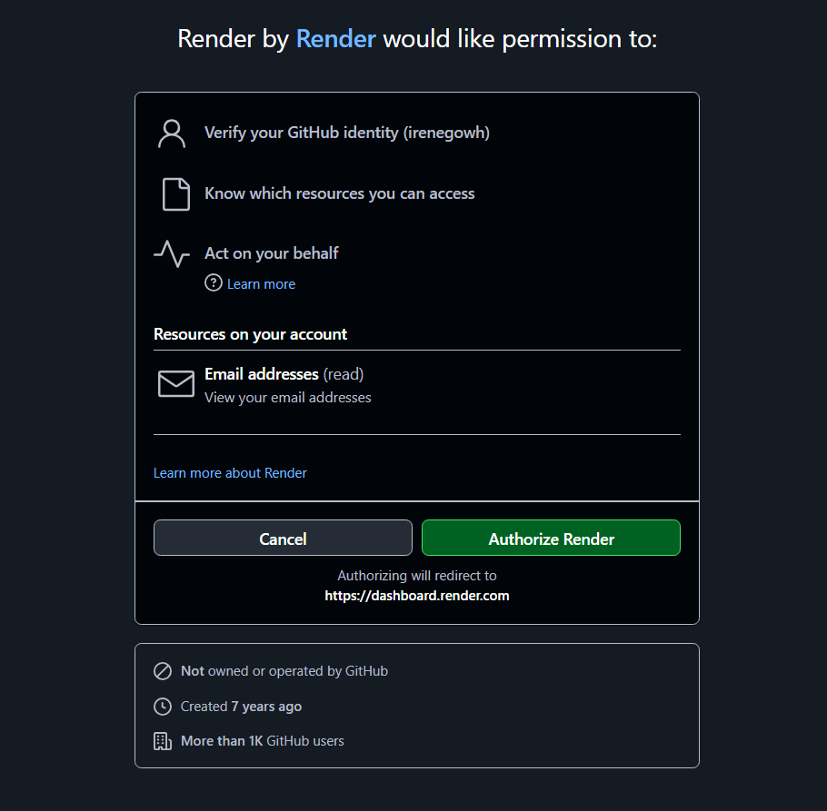

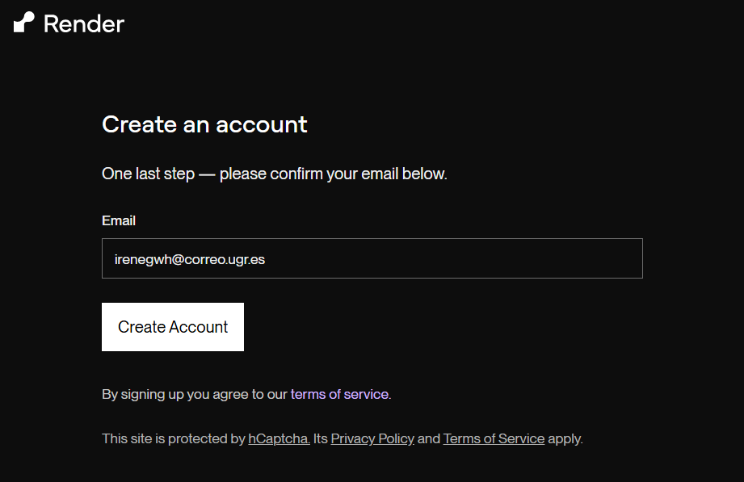

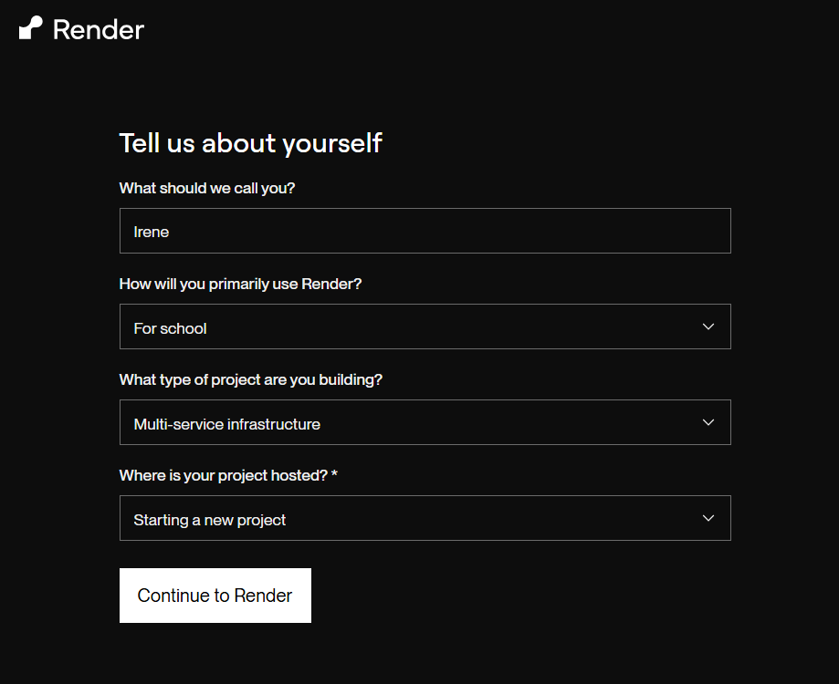  

## Creación de servicios
Una vez creado el proyecto en Render asociado al repositorio de Github, se crearon tres servicios:

Servicio web para la lógica de la aplicación:

URL app_service: 
[https://artigow.onrender.com](https://artigow.onrender.com/)

Servicio web para la parte de logging:
URL logs_service:
[https://logs-service-eb2r.onrender.com](https://logs-service-eb2r.onrender.com/)

Servicio POSTGRESQL para la base de datos:
URL db_service:

Interna: postgresql://user:(contraseña creada en Render)@dpg-cu8g8elsvqrc73baddcg-a/artigowdb_2lqj
External: postgresql://user:(contraseña creada en Render)@dpg-cu8g8elsvqrc73baddcg-a.frankfurt-postgres.render.com/artigowdb_2lqj
o para el CLI de Render: render psql dpg-cu8g8elsvqrc73baddcg-a

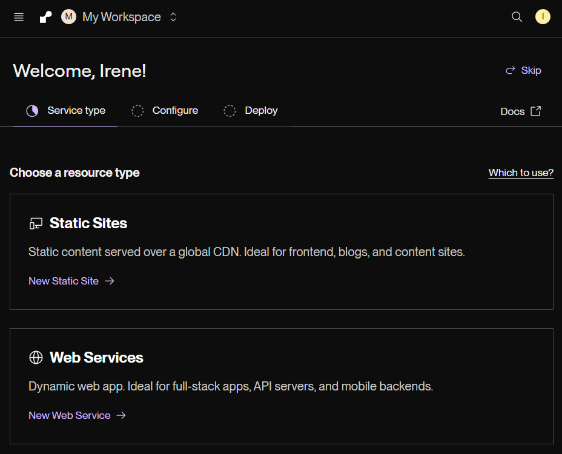  
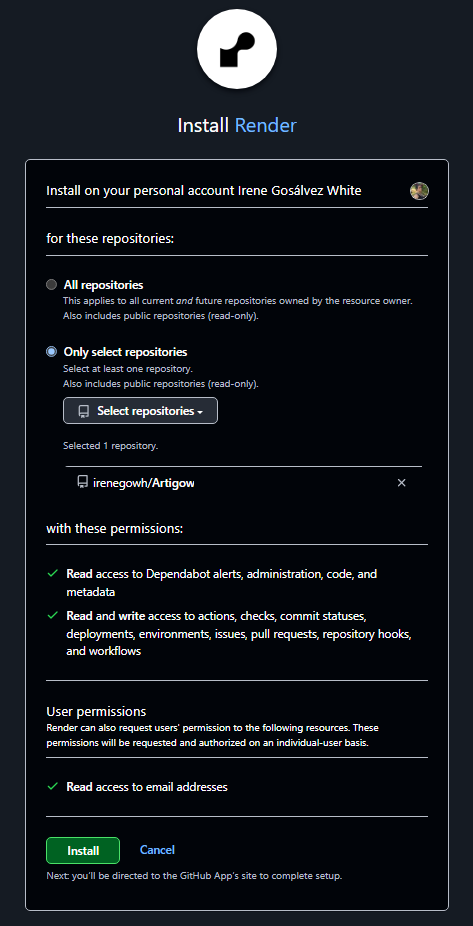  
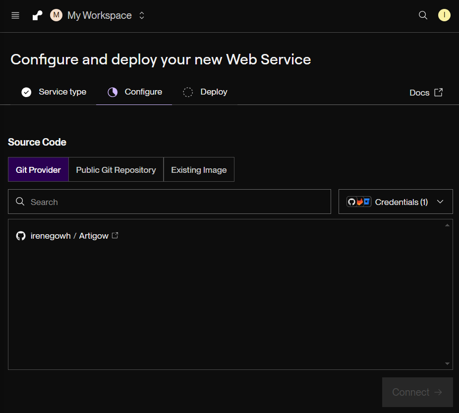  
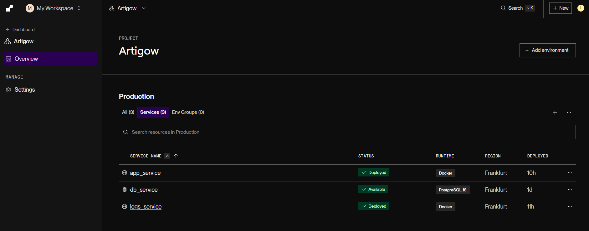  

## Configuración app_service
Este servicio contiene la lógica de la aplicación principal.

Se ha configurado el path para que tome la carpeta correspondiente a `app_service`, asegurándote de que contiene un archivo `Dockerfile` correctamente configurado.

Render detectará automáticamente el Dockerfile para construir la imagen.

Se configuraron las variables de entorno necesarias, como `DATABASE_URL`, `LOG_SERVICE_URL`, y otras dependencias.

Se estableció la región para el despliegue en Europa.

Y las demás opciones se han dejado por defecto para simplificar el proceso.

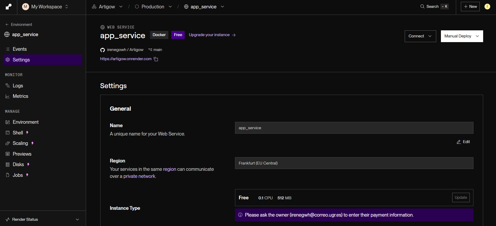  
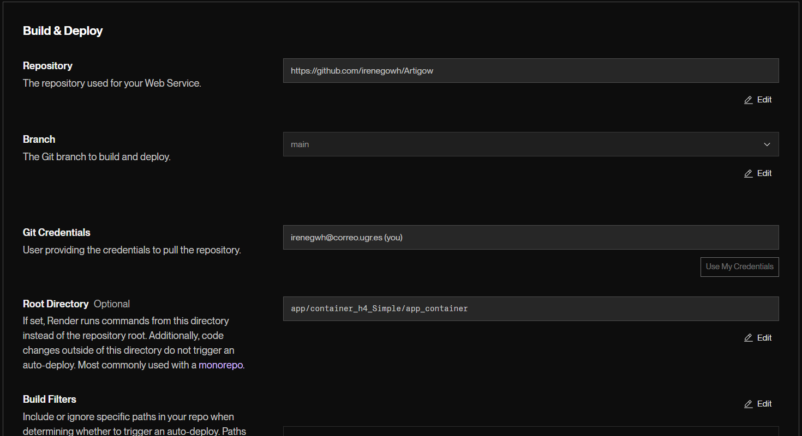  
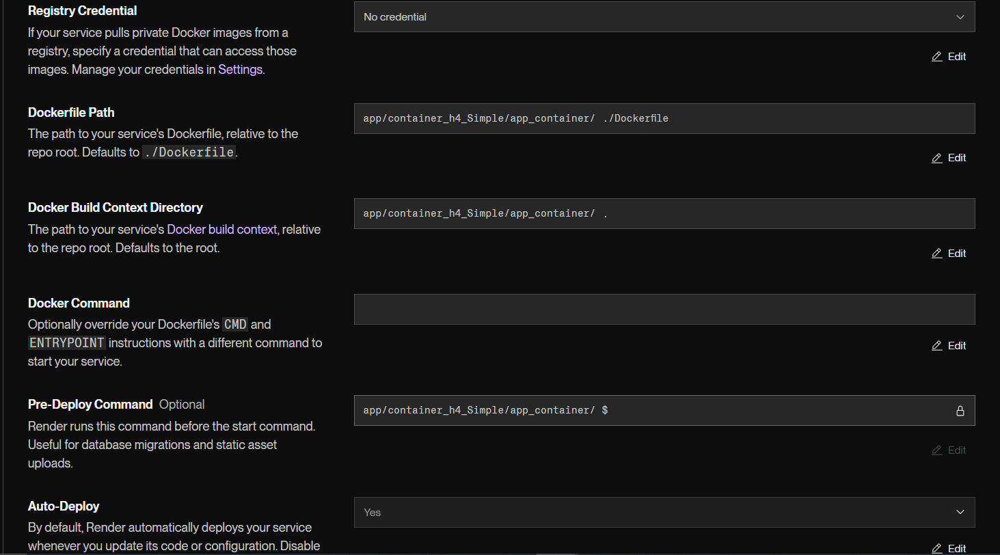  
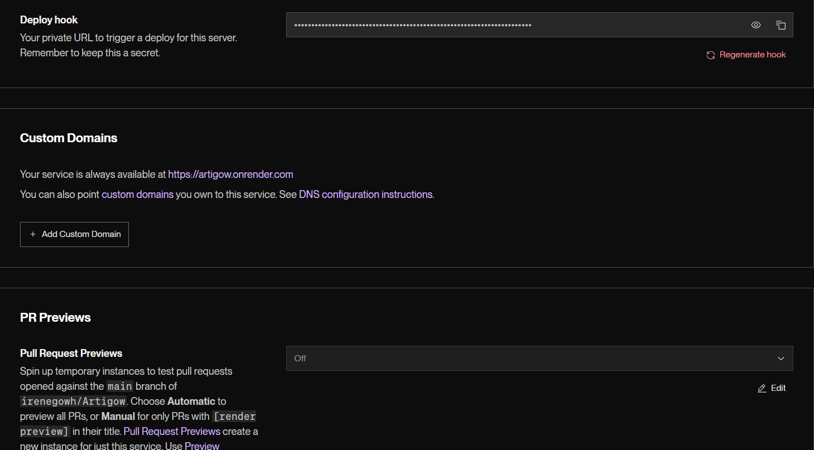  
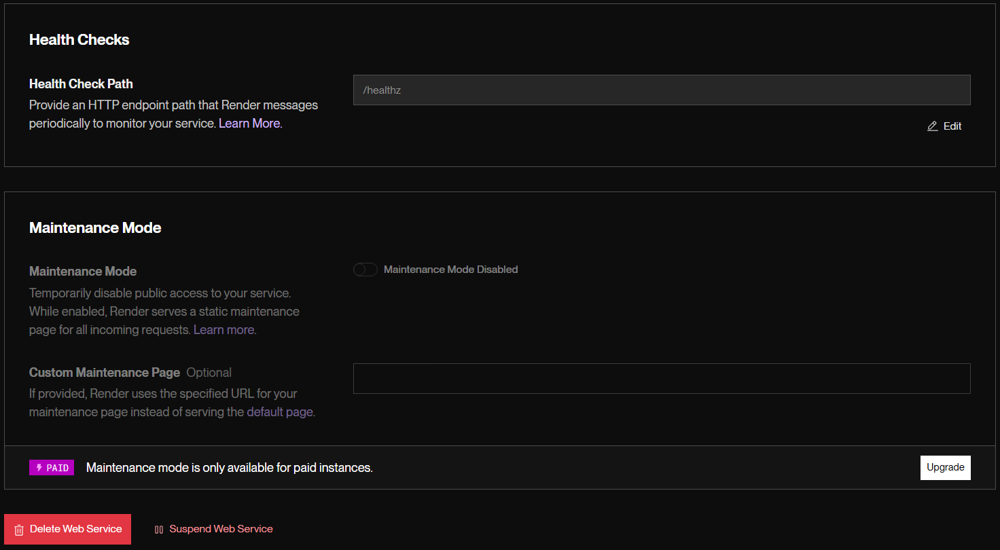  

### Soluciones a errores durante el despliegue:

Durante el despliegue de los servicios en Render, se identificaron varios problemas relacionados con la configuración de las URLs de los servicios. Estos problemas surgieron debido a que el código hacía referencia directa a los nombres de los servicios definidos en el entorno dockerizado (utilizando `docker-compose`). Sin embargo, Render no permite cargar el clúster completo de servicios directamente y asigna una URL única a cada servicio desplegado.

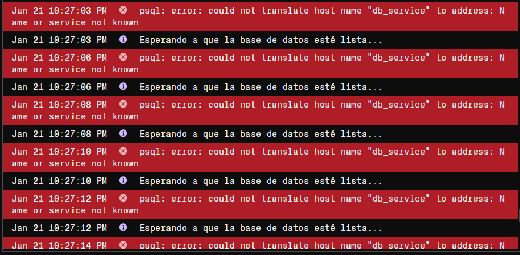  

### Modificaciones realizadas para resolver los errores:

1. **Uso de variables de entorno para las URLs**:
    
    En lugar de utilizar referencias estáticas como `http://logs_service:5003` o `http://db_service:5432`, se configuraron variables de entorno para almacenar las URLs generadas por Render. Esto permite que cada servicio utilice la dirección asignada automáticamente por Render.
    
    - Por ejemplo, la URL del servicio de logs (`logs_service`) se almacenó en una variable de entorno llamada `LOG_SERVICE_URL`.
    - De igual manera, la conexión con la base de datos (`db_service`) se configuró utilizando la variable `DATABASE_URL`.
2. **Configuración de las variables de entorno en Render**:
    
    Estas variables se configuraron directamente en la interfaz de Render en la sección de "Environment Variables" para cada servicio. Esto garantiza que los valores sean dinámicos y puedan cambiar si Render asigna una nueva URL.
    
3. **Actualización del código**:
    
    Se modificaron las referencias en el código para utilizar las variables de entorno en lugar de las URLs estáticas.

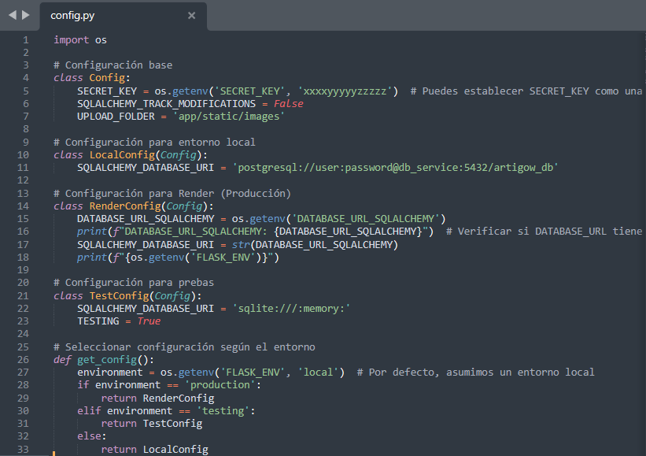  

Durante la configuración del servicio de base de datos PostgreSQL en Render, se tuvieron que realizar varias tareas y ajustes manuales para asegurar su correcto funcionamiento, tanto en la creación de bases de datos como en la gestión de permisos de usuario.

Bases de Datos Configuradas

1. **Bases de datos creadas manualmente**:
    - Por defecto, Render crea una base de datos inicial llamada `artigowdb_2lqj`.
    - Además, fue necesario crear manualmente otras dos bases de datos:
        - `artigow_db`: para la aplicación principal.
        - `artigow_logs_db`: dedicada exclusivamente al servicio de logs.
2. **Permisos y roles**:
    
    Se asignaron permisos al usuario `user` para cada una de las bases de datos creadas. Esto se realizó directamente desde la consola de PostgreSQL.

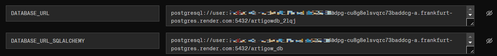  
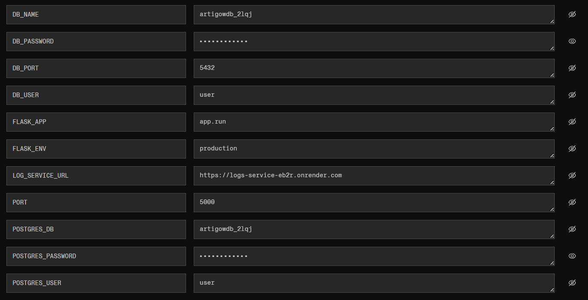  
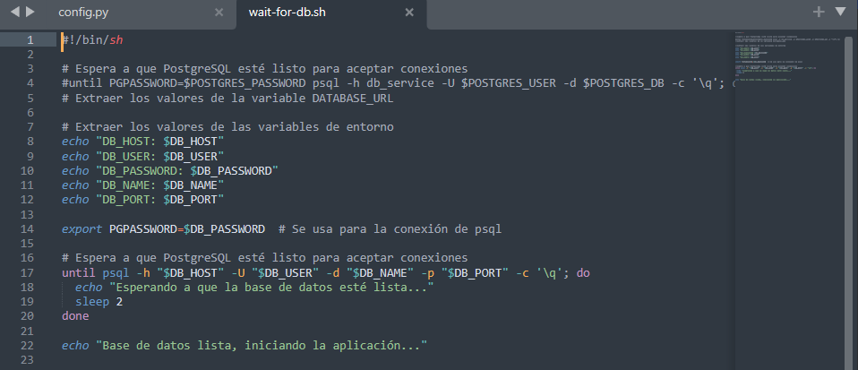  

Tablas creadas en artigow_db del servicio Postgre creado.

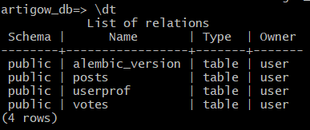 

### Logs del Despliegue y Operación de la App

1. **Logs de Despliegue Correcto**:
    
    Una vez solucionados los problemas de permisos y tablas, los servicios desplegados comenzaron a registrar logs indicando un funcionamiento correcto.
    
2. **Logs Generados por el Tráfico en la Aplicación**:
    - El servicio `app_service` comenzó a enviar logs al servicio de logs (`logs_service`), los cuales fueron correctamente almacenados en la base de datos `artigow_logs_db`.
    - Los registros incluyen eventos como solicitudes HTTP, accesos a la página principal y errores de autenticación.

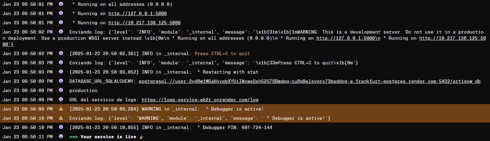  
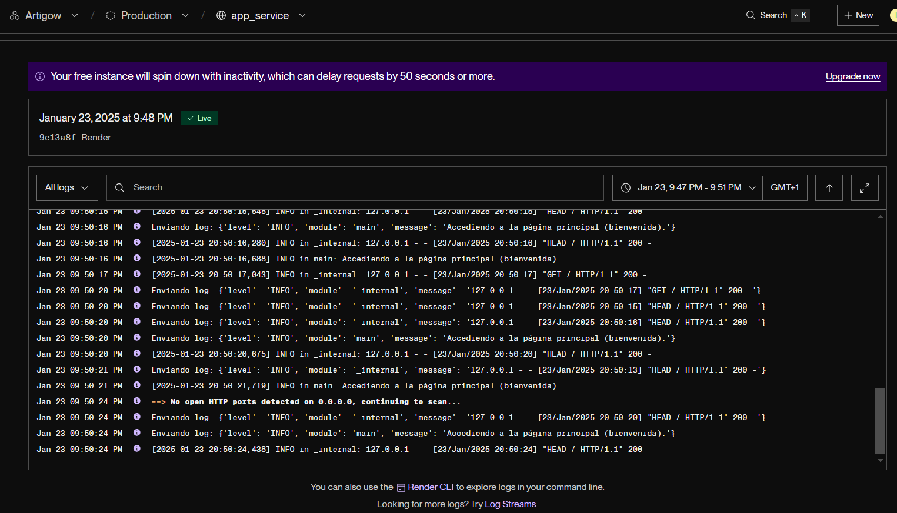  

### Ejemplo de uso de la aplicación:

La aplicación, tras la configuración y despliegue en Render, funciona correctamente y permite realizar las siguientes acciones principales, similares a las implementadas en el Hito 4 (Login, Creación de las publicaciones, Sistema de votación).

  
  
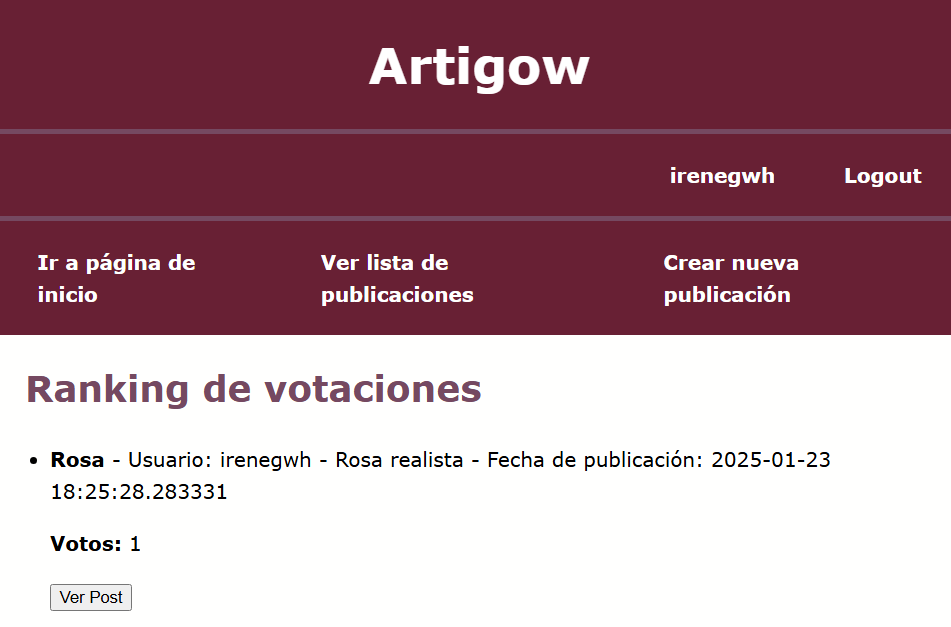  

## Configuración de db_service
El servicio de base de datos se ha configurado utilizando PostgreSQL en Render para gestionar las dos bases de datos requeridas por la aplicación (artigow_db y artigow_logs_db). A diferencia de la configuración inicial en docker-compose, Render no permite exponer servicios de bases de datos directamente como servicios web debido a la ausencia de puertos HTTP. Por esta razón, se desplegó un servicio de PostgreSQL en lugar de un contenedor independiente.

### Configuración del Servicio en Render
Creación del Servicio
Se seleccionó la opción de "Managed PostgreSQL" desde el panel de Render.
Se configuró una base de datos inicial (artigowdb_2lqj), que Render crea automáticamente al desplegar el servicio.

Además de la base de datos predeterminada, se crearon manualmente dos bases de datos adicionales:
artigow_db: Para almacenar datos relacionados con la lógica principal de la aplicación.
artigow_logs_db: Dedicada exclusivamente a los logs enviados desde app_service.

Se asignaron permisos al usuario user (proporcionado por Render) para acceder y gestionar las bases de datos.
Esto se realizó utilizando la consola de PostgreSQL proporcionada por Render o desde una herramienta cliente de base de datos.

### Variables de Entorno:
Render proporciona automáticamente las siguientes URLs y credenciales, que se configuraron como variables de entorno en app_service y logs_service:
Interna: postgresql://user:<contraseña>@dpg-cu8g8elsvqrc73baddcg-a/artigowdb_2lqj
Externa: postgresql://user:<contraseña>@dpg-cu8g8elsvqrc73baddcg-a.frankfurt-postgres.render.com/artigowdb_2lqj
Estas variables permiten que los servicios conecten con la base de datos de manera dinámica y segura.

Render proporciona un comando para conectarse directamente al servicio de PostgreSQL desde la línea de comandos:
```bash
render psql dpg-cu8g8elsvqrc73baddcg-a
```

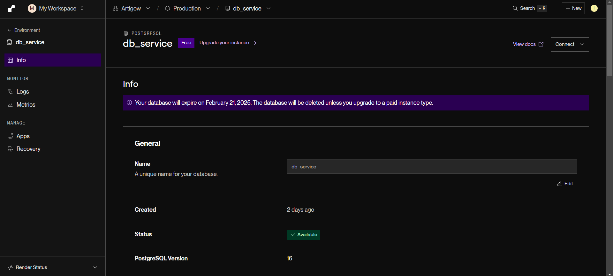  
  
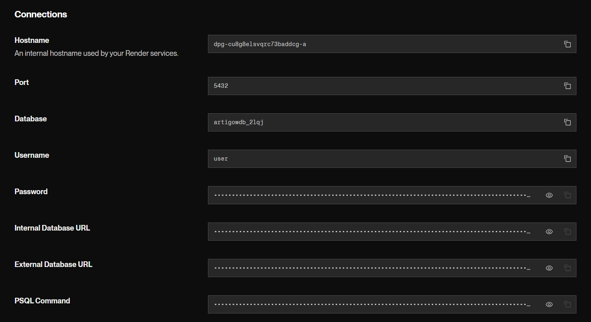  
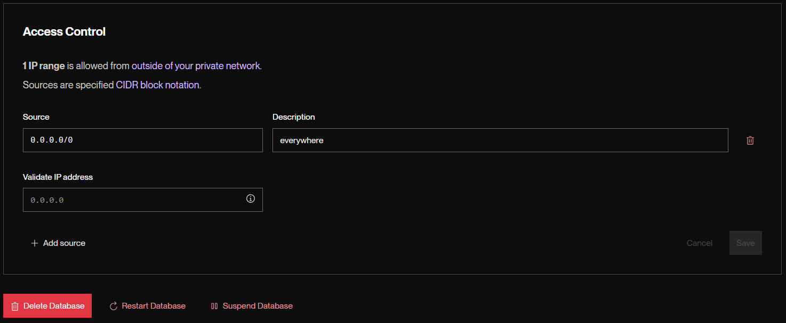  

Bases de Datos y Tablas
Bases de Datos Disponibles:

artigow_db: Contiene las tablas necesarias para las funcionalidades de la aplicación, como usuarios, publicaciones y votos.
artigow_logs_db: Almacena los registros de tráfico y actividad enviados desde app_service.
Estructura de las Tablas:

Se generaron automáticamente las tablas en la base de datos al desplegar el servicio y ejecutar la lógica de inicialización desde los contenedores. Las tablas incluyen:
En artigow_db:
userprof
posts
votes

En artigow_logs_db:
application_logs

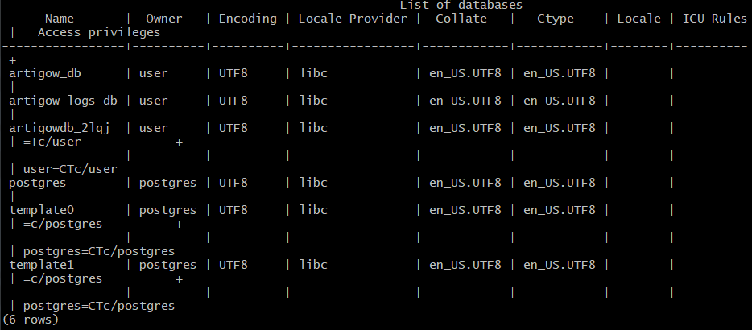  
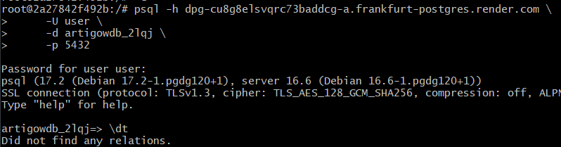  
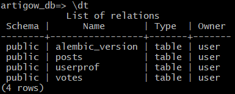  
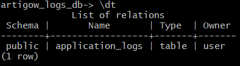 

Configuración de logs_service
El servicio logs_service se ha configurado para recibir, procesar y almacenar los logs generados por app_service. Al igual que app_service, este servicio se desplegó en Render como un contenedor Docker.

Proceso de Configuración en Render
Creación del Servicio:

Se seleccionó la carpeta en el repositorio donde se encuentra el Dockerfile de logs_service.
Render detectó automáticamente el archivo Dockerfile y construyó la imagen necesaria para el despliegue.
La región para el despliegue se configuró en Europa para mantener baja la latencia

Se configuraron variables de entorno similares a las de app_service, pero adaptadas al contexto de logs_service.
En particular, se especificaron:
DATABASE_URL: La conexión con la base de datos artigow_logs_db, que guarda los registros en la tabla application_logs.

Se dejaron las configuraciones predeterminadas en Render, como en app_service, para simplificar el despliegue.

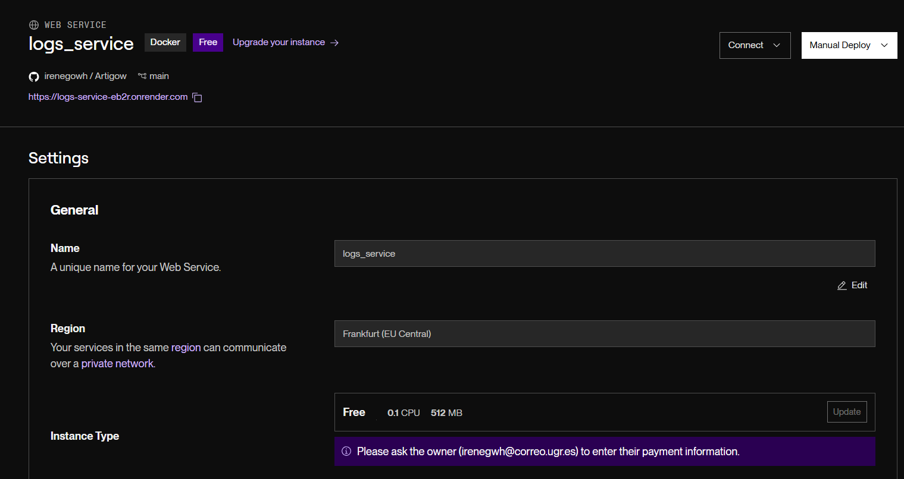  
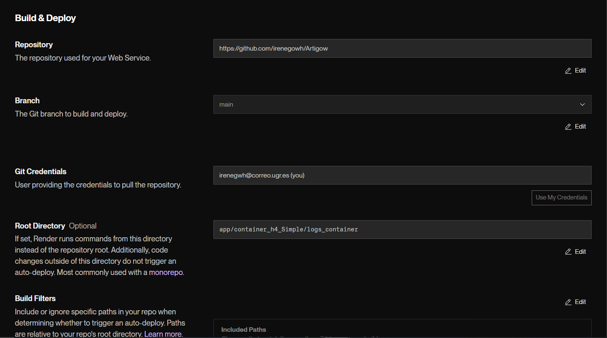  
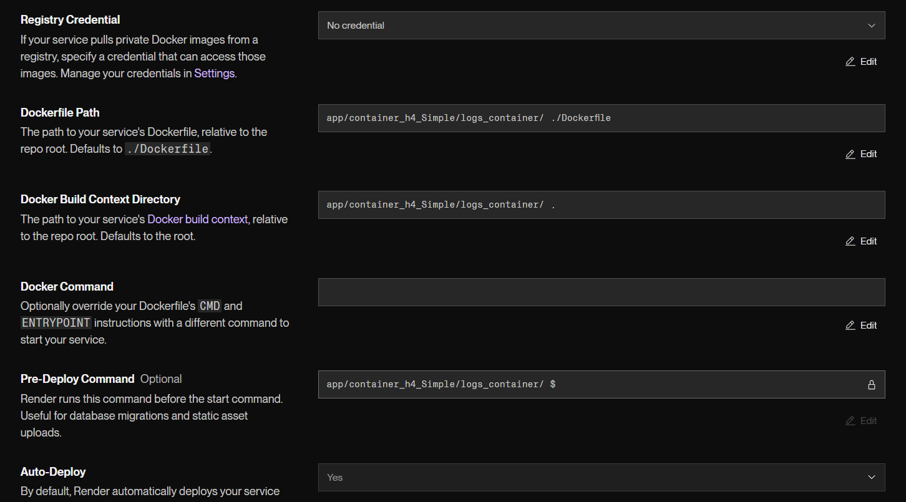  
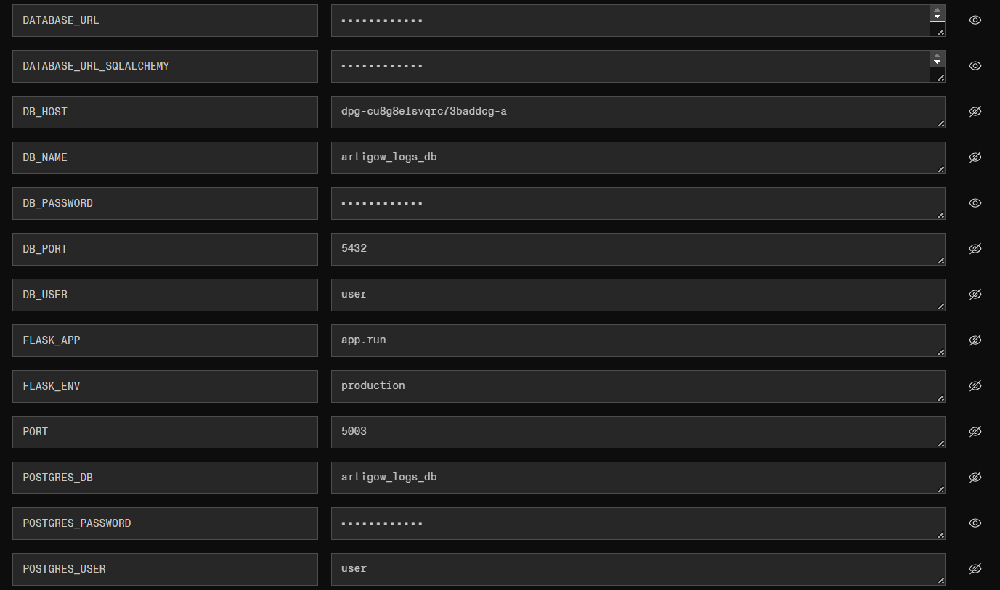  

Modificaciones Realizadas para el Despliegue
Al igual que en app_service, fue necesario ajustar las referencias de las URLs en el código para que usaran las variables de entorno configuradas en Render en lugar de direcciones estáticas definidas en el entorno docker-compose.

Por ejemplo, la conexión al servicio de base de datos de logs se realizó mediante la variable DATABASE_URL.
Estas modificaciones aseguraron que logs_service pudiera conectarse correctamente a la base de datos artigow_logs_db para almacenar los registros.

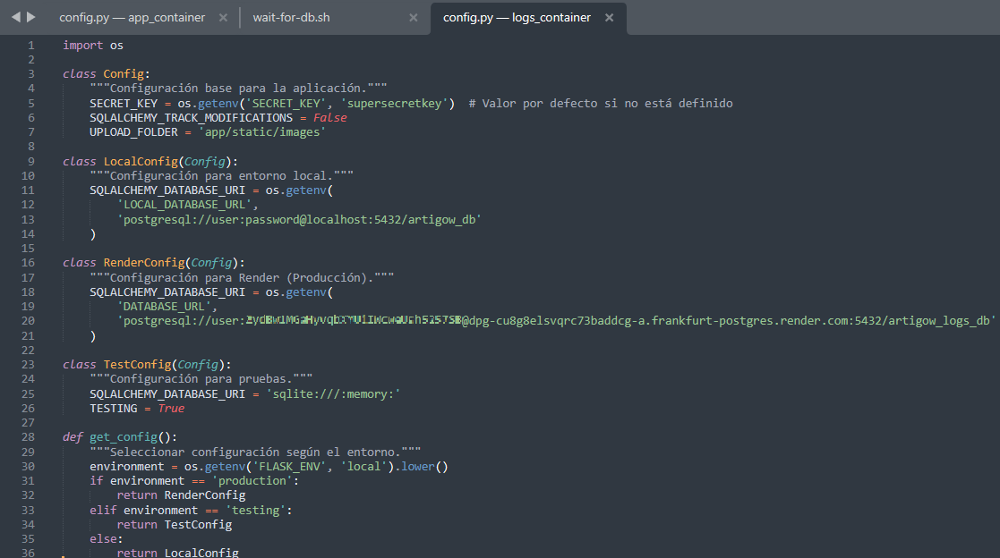  

Los logs se almacenan en la base de datos artigow_logs_db, que se configuró previamente en el servicio db_service.
Los registros se guardan en la tabla application_logs.

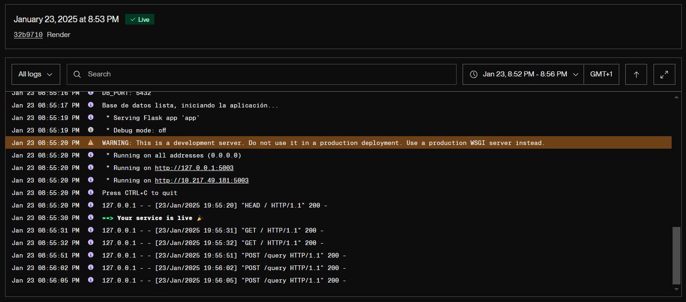  

Para probar que el servicio está recibiendo los logs correctamente, se realizaron solicitudes desde app_service, que envía logs mediante la URL definida en la variable LOG_SERVICE_URL.
Para visualizar los logs almacenados en la base de datos, se ejecutó la siguiente consulta SQL desde la interfaz web configurada para realizar la consulta en la base de datos artigow_logs_db:

```bash
SELECT * FROM application_logs WHERE level = 'INFO';
```

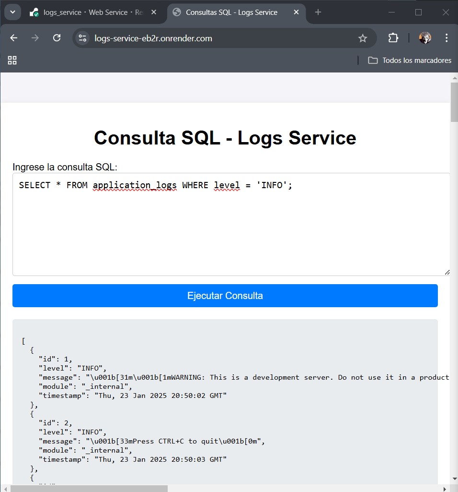  

